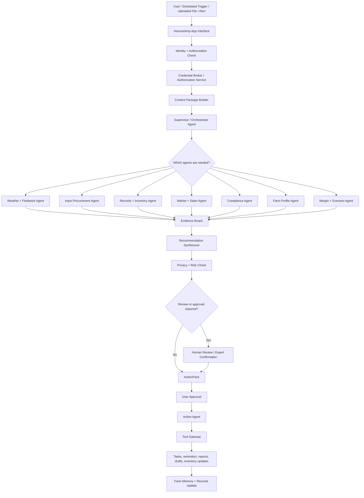
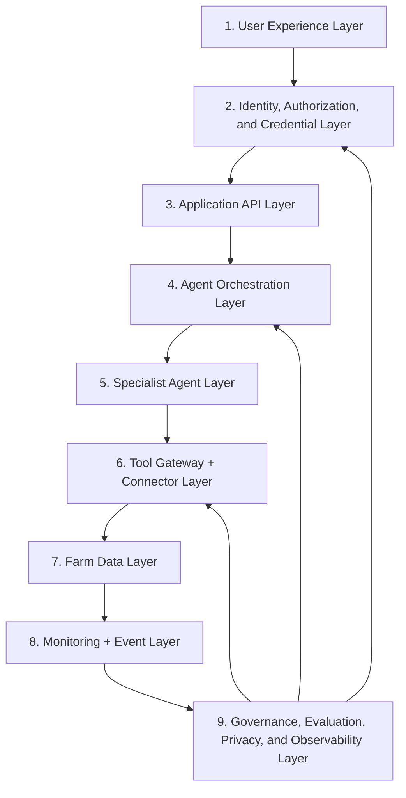
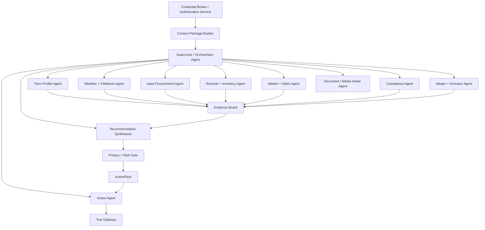

# 02_AGENT_ARCHITECTURE.md

# Agent Architecture: HarvestAmp

**Version:** 0.5  
**Date:** 2026-06-23  
**Status:** Corrected source-of-truth architecture for MVP implementation planning  
**Product / agent name:** HarvestAmp  
**Related documents:**

- `01_PRODUCT_BRIEF.md`
- `03_FARM_PROFILES.md`
- `04_DATA_SOURCES.md`
- `05_AGENT_CONTRACTS.md`
- `06_RISK_AND_HUMAN_REVIEW_POLICY.md`
- `07_SAMPLE_SCENARIOS.md`
- `08_EVALUATION_TESTS.md`
- `09_MVP_SCOPE.md`
- `10_BUILD_PLAN.md`
- `DECISION_LOG.md`
- `CHANGELOG.md`
- `configs/human_review_rules.yaml`
- `schemas/*.schema.yaml`
- `fixtures/*.yaml`

**Primary build environment:** Google AI and Google Cloud stack, with Antigravity used for focused development tasks, Google ADK-style workflow patterns for agent orchestration, Gemini / Vertex AI for reasoning and synthesis, Google Cloud services for data/infrastructure, and Google Cloud Marketplace / AI Agent Marketplace as a potential later distribution channel.

---

## 0. Revision Notes

### 0.5 Corrected architecture split

This version:

- Uses **HarvestAmp** consistently.
- Treats `DECISION_LOG.md` as binding for accepted architecture and product decisions.
- References `10_BUILD_PLAN.md` as the current build-plan document.
- Removes embedded machine-readable YAML policy content from this architecture document.
- Places machine-readable human-review policy rules in `configs/human_review_rules.yaml`.
- Keeps this document focused on system architecture, component boundaries, data flow, privacy, security, orchestration, and build sequencing.
- Adds source-metadata and connector-result concepts from `04_DATA_SOURCES.md`.
- Clarifies that full Google Cloud deployment is a target direction, not required for the first local mock MVP.

### 0.4 HarvestAmp rename

Renamed the product from a prior working name to **HarvestAmp** across live source-of-truth documents. Archived snapshots may retain prior names for rollback/history only.

### 0.3 Privacy, LLM access, credential, and disclosure guardrails

Made farm data protection a core architecture feature. Added Credential Broker / Authorization Service, optional Credential Setup Assistant, Tool Gateway, data sensitivity classes, task-scoped context, cross-farm isolation, credential rules, disclosure controls, audit logging, and model-training/evaluation restrictions.

### 0.2 Naming update and authorization layer

Added explicit product naming and a credential/authorization concept.

### 0.1 Original architecture

Initial multi-agent architecture for a farming operations and procurement advisor.

---

## 1. Purpose of This Document

This document defines the architecture for **HarvestAmp**, a multi-agent farming operations, procurement, and input-margin advisor.

HarvestAmp is intended to help farmers, farm managers, advisors, and eventually co-ops or ag retailers answer questions such as:

- What should I do on my farm this week?
- Can I spray, plant, irrigate, harvest, deliver, attend market, or delay based on weather?
- Should I buy diesel, propane, fertilizer, seed, feed, packaging, parts, or other inputs now or wait?
- How do supplier quotes compare after delivery, application, nutrient content, discounts, and timing?
- How do input costs affect margin, break-even, or direct-market profitability?
- What inventory is low?
- What deadlines, documents, or compliance items need attention?
- What should be escalated to an agronomist, certifier, veterinarian, crop insurance agent, accountant, attorney, or other professional?

This document is a source of truth for Antigravity tasks and later engineering work. It is not implementation code.

Machine-readable rules belong in configuration and schema files, especially:

```text
configs/human_review_rules.yaml
schemas/*.schema.yaml
fixtures/*.yaml
```

---

## 2. Architecture Summary

HarvestAmp should be built as a **supervised multi-agent decision-support system** with strong data-access, privacy, credential, and human-review boundaries.

Core pattern:

> Trusted data enters a normalized farm data layer. Authorization and privacy controls determine what may be accessed. A task-scoped context package gives agents only the minimum necessary data. A supervisor routes work to specialist agents. Specialist agents produce evidence-backed findings. A synthesizer turns findings into farmer-friendly recommendations. A risk and human-review gate blocks high-risk action. User-approved actions update records, tasks, reports, and memory.

HarvestAmp is not one giant chatbot. It is a product system with:

- User interface.
- Identity and access control.
- Credential and tool governance.
- Farm data layer.
- Source metadata and evidence tracking.
- Monitoring loops.
- Multi-agent orchestration.
- Human-review gates.
- Auditability.
- Privacy controls.
- Evaluation tests.
- Marketplace packaging later.

---

## 3. High-Level Flow



---

## 4. Core Architecture Principles

### 4.1 Farm-specific beats generic

Recommendations should use the farm profile, farm type, inventory, sales channels, role, and source-labeled evidence.

Bad:

> Rain is possible this week.

Better:

> Rain Wednesday may reduce fieldwork options for Prairie View and Saturday morning rain may affect Green Basket's farmers market setup.

### 4.2 Data first, agent second

Agents reason over structured farm context, source-labeled evidence, and approved tools. HarvestAmp should not depend on random web browsing as its production data strategy.

Preferred data order:

1. User-approved farm records.
2. Recent uploaded/manual supplier quotes.
3. Farm inventory records.
4. Farm plan and profile data.
5. Public benchmark or official data.
6. General agricultural context.
7. Clearly labeled assumptions.

### 4.3 Agents receive task-scoped context, not full farm access

A fuel-buying workflow may need fuel quote, tank level, capacity, expected demand, fieldwork window, recent purchase history, and risk preference. It should not automatically receive organic certification documents, customer lists, unrelated supplier contracts, full financial statements, or other farms' quotes.

### 4.4 Raw credentials never enter LLM context

Agents must never receive raw credentials, including passwords, API keys, OAuth tokens, supplier portal logins, service-account keys, bank credentials, or private keys. Agents request capabilities. Credential Broker and Tool Gateway handle authentication, authorization, credential retrieval, and audit logging.

### 4.5 No cross-farm leakage

HarvestAmp must never use Farm A's private data to answer Farm B's question unless an explicit authorized multi-farm workflow permits it and the data is permissioned, de-identified, or aggregation-safe.

### 4.6 Specialist agents should be narrow

Specialization makes HarvestAmp easier to test, debug, improve, constrain, and govern.

### 4.7 Recommendations require evidence

Every meaningful recommendation should include evidence, source timestamps, assumptions, missing data, confidence, data sensitivity, and human-review status.

### 4.8 Human approval before meaningful external actions

During MVP, HarvestAmp may draft tasks, reminders, supplier messages, customer messages, reports, and inventory updates. It must not send, purchase, disclose, file, delete, grant access, or change official records without required approval.

### 4.9 Deterministic services handle security and math

Use deterministic software for authorization, credential handling, tool permissions, unit conversion, nutrient math, freshness checks, approval-state transitions, audit logging, and source hierarchy.

### 4.10 Start with mock data, then manual entry, then integrations

MVP data maturity path:

1. Synthetic fixtures.
2. Manual entry.
3. Uploaded documents.
4. Public official APIs.
5. Google Workspace integrations.
6. Supplier integrations.
7. Farm-system integrations.
8. Sensors and equipment data.

---

## 5. MVP Scope Reminder

The first MVP supports two synthetic farm profiles.

### 5.1 Prairie View Farms

Large conventional row-crop profile.

High-value workflows:

- Weekly row-crop action plan.
- Fuel buy/wait/split recommendation.
- Fertilizer quote comparison.
- Weather-to-fieldwork guidance.
- Spray-window guardrails.
- Commodity/storage scenario framing.
- Inventory and task logging.
- Role-based privacy boundary.

### 5.2 Green Basket Organics

Small certified organic direct-market profile.

High-value workflows:

- Weekly organic direct-market plan.
- Farmers market pack list.
- CSA and restaurant planning.
- Packaging and supply inventory check.
- Organic input verification guardrail.
- Market-day weather and harvest adjustment.
- Seed/transplant ordering reminders.
- Food-safety and certification record reminders.

---

## 6. Conceptual Google Stack Mapping

| Layer | Suggested Google product area | Role in HarvestAmp |
|---|---|---|
| Development workflow | Antigravity | Focused build tasks, refactoring, debugging, walkthroughs, artifact review |
| Agent framework | Google ADK or ADK-style workflows | Agent definitions, tools, routing, graph workflows, sequential/parallel/loop patterns |
| Reasoning model | Gemini / Vertex AI | Interpret requests, extract documents, reason over evidence, synthesize recommendations |
| Agent deployment | Agent Runtime / managed runtime later | Production deployment, scaling, evaluation, governance, observability |
| Identity | IAM / Agent Identity concepts | User, service, agent, and tool access boundaries |
| Credentials | Secret Manager / managed auth patterns | Store and protect OAuth credentials, API keys, supplier credentials, and secrets outside prompts |
| Tool governance | Tool Gateway pattern | Tool allowlists, access policies, redaction, disclosure controls |
| Privacy inspection | Sensitive Data Protection optional | Inspect, classify, redact, mask, or de-identify sensitive data |
| Session/context | Sessions / app session store | Short-term interaction state |
| Long-term memory | Memory Bank / app database | Farm preferences and approved memories |
| App backend | Cloud Run / functions / local prototype first | APIs, UI backend, webhook endpoints, connector endpoints |
| Scheduled monitoring | Cloud Scheduler later | Recurring checks for weather, prices, deadlines, inventory |
| Event messaging | Pub/Sub later | Decouple scheduled jobs, connector updates, agent workflows |
| Operational database | Firestore, Cloud SQL, AlloyDB, or local JSON initially | Farms, fields, suppliers, inventory, quotes, tasks, recommendations, permissions |
| Analytics | BigQuery later | Usage, evaluation, business metrics, de-identified aggregate insights |
| File storage | Cloud Storage later | Uploaded quotes, invoices, reports, images, generated exports |
| Monitoring | Cloud Logging / Monitoring / Trace later | Agent runs, errors, latency, tool calls, audit events |
| Distribution | Google Cloud Marketplace / AI Agent Marketplace later | Enterprise listing, private offers, subscription/usage packaging |

### 6.1 Google product assumptions to verify

Before production, re-check current Google product names, APIs, pricing, IAM/Agent Identity behavior, ADK/Runtime features, marketplace requirements, and data-governance options.

### 6.2 Antigravity usage principle

Antigravity should not be treated as durable memory. Every task should read source-of-truth files and update affected docs, schemas, tests, decision log, and changelog.

---

## 7. System Layers

HarvestAmp has nine core layers:



### 7.1 User Experience Layer

Interfaces:

- Chat / prompt.
- Voice input later.
- Dashboard.
- Alerts.
- Task list.
- Upload/manual-entry center.
- Farm profile setup.
- Supplier and inventory screens.
- Weekly plan screen.
- Reports/export screen.
- Data-source connection screen.
- Privacy, permissions, and audit screen.

### 7.2 Identity, Authorization, and Credential Layer

Responsible for:

- User authentication.
- User role and tenant checks.
- Farm, field, supplier, document, and action authorization.
- User-delegated access flows.
- Agent/service identities.
- Credential storage.
- Token refresh and revocation.
- Tool-level authorization.
- Audit logging.

This layer is a security boundary, not an LLM agent.

### 7.3 Application API Layer

Responsible for:

- User/farm selection.
- Role simulation or login.
- Session creation.
- File upload/manual entry handling.
- Request submission.
- ActionPack return.
- Persisting approved actions.
- Serving dashboard data.

### 7.4 Agent Orchestration Layer

Responsible for:

- Intent routing.
- Supervisor decisions.
- Workflow selection.
- Agent invocation.
- Context package construction.
- Evidence aggregation.
- Privacy and human-review gating.
- Recommendation synthesis.
- Memory updates.

### 7.5 Specialist Agent Layer

Responsible for domain reasoning:

- Farm profile.
- Weather and fieldwork.
- Procurement.
- Records and inventory.
- Markets and sales.
- Compliance.
- Margin and scenario analysis.
- Recommendation synthesis.
- Action generation.
- Document/media intake.
- Optional credential setup guidance.

### 7.6 Tool Gateway + Connector Layer

Responsible for:

- Tool allowlist enforcement.
- Weather connector.
- Price benchmark connector.
- Document extraction.
- Supplier quote parser.
- Unit conversion.
- Nutrient conversion.
- Inventory calculator.
- Calendar/reminder tool later.
- Task creation tool.
- Report generation.
- Email draft tool.
- Compliance rule lookup.
- Credentialed supplier retrieval later.
- Payload redaction.
- Connector result metadata.

### 7.7 Farm Data Layer

Stores:

- Farm profiles.
- Users, roles, permissions.
- Fields and growing areas.
- Crop plans.
- Suppliers.
- Input products.
- Inventory.
- Quotes.
- Invoices.
- Tasks.
- Deadlines.
- Evidence.
- Agent findings.
- Recommendations.
- User decisions.
- Monitoring thresholds.
- Audit metadata.
- Source metadata.
- Data-sensitivity labels.

### 7.8 Monitoring + Event Layer

Responsible for:

- Scheduled checks.
- Threshold detection.
- Event-driven agent activation.
- Alert deduplication.
- Staleness detection.
- Escalation rules.
- Privacy-aware routing.

For first MVP, monitoring may be simulated with fixture updates.

### 7.9 Governance, Evaluation, Privacy, and Observability Layer

Responsible for:

- Human-review policy.
- Access validation.
- Privacy controls.
- Logging.
- Agent traceability.
- Evaluation tests.
- Regression scenarios.
- Prompt/version tracking.
- Data provenance.
- Auditability.
- Data-retention policies.
- Disclosure-control tests.
- Cross-tenant leakage tests.

---

## 8. Identity, Authorization, and Credential Architecture

### 8.1 Core rule

> HarvestAmp agents request capabilities, not credentials.

Agents do not hold passwords, tokens, API keys, supplier logins, or secrets. They request a capability such as retrieving a quote or drafting a message. Credential Broker and Tool Gateway decide whether the request is allowed.

### 8.2 Credential Broker / Authorization Service

Deterministic infrastructure.

Responsibilities:

- Authenticate user or service principal.
- Verify farm, tenant, supplier, document, and field access.
- Validate workflow access to requested data.
- Manage connection states for external sources.
- Request, store, rotate, and revoke credentials through approved infrastructure.
- Issue scoped tool-access grants where appropriate.
- Return permission decisions to Tool Gateway.
- Log sensitive access.

Must not:

- Send raw credentials to any LLM prompt.
- Let agents decide their own permissions.
- Allow cross-tenant access without explicit authorization.
- Treat uploaded credentials as ordinary document text.

### 8.3 Credential Setup Assistant

Optional user-facing assistant that explains secure connection flows. It is not a credential vault.

It may:

- Explain why a data source is useful.
- Explain requested permissions.
- Guide OAuth/API connection flows.
- Help label supplier data sources.
- Explain revocation.

It must not:

- Ask for passwords or API keys in chat.
- Store credentials in memory.
- Display tokens.
- Work around permission failures.

### 8.4 Tool Gateway

Mediates all agent-to-tool and agent-to-external-system calls.

Responsibilities:

- Enforce allowlisted tools.
- Check user identity, agent identity, farm ID, tenant ID, requested data class, purpose, and approval state.
- Enforce least privilege.
- Redact unnecessary sensitive fields.
- Prevent unauthorized external disclosure.
- Attach source and audit metadata to results.
- Block policy violations.

### 8.5 Policy Engine

Defines access and disclosure rules across:

- User role.
- Farm role.
- Tenant role.
- Agent identity.
- Tool identity.
- Data class.
- Workflow purpose.
- Source authorization.
- Destination of disclosure.
- Human-approval status.

The first deterministic policy config lives in:

```text
configs/human_review_rules.yaml
```

### 8.6 Audit Logger

Sensitive data access should be logged.

Required `AuditEvent` fields:

```text
audit_event_id
timestamp
tenant_id
farm_id
user_id
user_role
agent_id
workflow_id
tool_name
data_classes_accessed
source_ids_accessed
action_requested
action_allowed
policy_decision
external_disclosure_destination
human_approval_id
redaction_applied
```

---

## 9. Farm Data Privacy, Confidentiality, and LLM Access Guardrails

HarvestAmp treats farm data as private commercial information.

### 9.1 Data sensitivity classes

| Class | Description | Examples | LLM access |
|---|---|---|---|
| Public | Public or non-sensitive reference data | Weather forecast, USDA reports, extension bulletins | Allowed when relevant |
| Farm Internal | Operational data with lower sensitivity | General task lists, equipment reminders | Allowed when task-relevant |
| Farm Confidential | Commercially sensitive operating data | Field boundaries, acreage, crop plans, suppliers, inventory, tank levels | Task-scoped authorization only |
| Farm Restricted | Highly sensitive commercial, financial, regulatory, or competitive data | Supplier quotes, invoices, contracts, break-even, margin, marketing plans, crop insurance, organic docs | Directly required and authorized only; redaction preferred |
| Credentials and Secrets | Authentication material | Passwords, OAuth tokens, API keys, private keys, supplier logins | Never allowed in LLM prompts |

### 9.2 Task-scoped context principle

Each agent receives only data needed for the current task. Use summaries or derived values where raw values are unnecessary.

### 9.3 Credential rule

Credentials and secrets must never be included in prompts, memory, transcripts, logs, vector stores, test fixtures, demos, reports, or generated files.

If a user pastes a credential:

1. Refuse to use it directly.
2. Warn not to share credentials in chat.
3. Route to secure connection flow.
4. Redact/quarantine where possible.

### 9.4 Cross-farm isolation rule

No private data from one farm should be used for another farm unless explicitly authorized and permissioned/aggregated/de-identified.

### 9.5 Supplier disclosure rule

Supplier-facing communication must not include competitor quotes, break-even values, full inventory, yield estimates, other suppliers, marketing strategy, or other farm data unless the user explicitly approves that exact disclosure.

### 9.6 External tool disclosure rule

External tools receive only data required for the tool call.

Examples:

- Weather API: location/grid only, not farm financials.
- Calendar API: approved event details only.
- Supplier email: user-approved message body only.
- Document extraction: uploaded document only, no unrelated farm records.

### 9.7 Model training and evaluation data rule

Do not use identifiable customer farm data for model training, fine-tuning, public demos, benchmark datasets, or shared evaluations without explicit authorization.

Use synthetic, public, de-identified, or customer-approved examples.

### 9.8 Memory rule

HarvestAmp memory may store useful, authorized, policy-compliant farm facts, preferences, decisions, tasks, and evidence references.

Memory should not store raw credentials, unauthorized document text, cross-tenant data, or one-time sensitive values that are not needed later.

---

## 10. Source Metadata and Connector Results

Every connector, fixture loader, document extraction, manual entry, or synthetic data item should include source metadata.

### 10.1 SourceMetadata

```text
SourceMetadata
- source_id
- source_name
- source_type
- retrieved_at
- source_published_at
- valid_until
- freshness_status
- trust_tier
- privacy_class
- farm_id
- authorization_status
- evidence_id
- extraction_confidence
- missing_fields
- assumptions
```

### 10.2 ConnectorResult

```text
ConnectorResult
- status
- source_metadata
- data
- missing_fields
- assumptions
- redactions_applied
- audit_event_id
```

### 10.3 Freshness statuses

```text
current
recent
stale
expired
unknown
```

### 10.4 Trust tiers

```text
T1 Official / primary
T2 Authorized partner
T3 User-entered
T4 Curated advisory
T5 General web / unverified
```

### 10.5 Connector failure behavior

If data is unavailable, stale, unauthorized, or missing:

- Do not hallucinate.
- Return missing-data metadata.
- Lower confidence.
- Use cached data only when labeled cached/stale.
- Skip high-risk recommendations when required data is unavailable.
- Ask the user for updated information or authorization when appropriate.

---

## 11. Data Flow

```mermaid
flowchart LR
    A[External Sources] --> B[Connectors / Intake Tools]
    C[User Inputs] --> B
    D[Uploads] --> B

    B --> E[Normalize + Validate]
    E --> F[Classify Sensitivity + Source Metadata]
    F --> G[Farm Data Layer]

    H[User / Trigger] --> I[Authorization Check]
    I --> J[Context Package Builder]
    G --> J
    J --> K[Prompt Redaction + Minimum Necessary Context]
    K --> L[Supervisor Agent]
    L --> M[Specialist Agents]
    M --> N[Evidence Board]
    N --> O[Recommendation Synthesizer]
    O --> P[Privacy + Human Review Gate]
    P --> Q[ActionPack]
    Q --> R[User Approval]
    R --> S[Action Agent]
    S --> T[Tool Gateway]
    T --> U[Records, Tasks, Alerts, Reports, Memory Updates]
```



---

## 12. Context Package Builder

Before specialists run, HarvestAmp builds a task-scoped `FarmContextPackage`.

```text
FarmContextPackage
- context_package_id
- workflow_id
- tenant_id
- farm_id
- user_id
- user_role
- user_permissions
- agent_permissions
- authorization_decision_id
- farm_type
- sales_channels
- location_scope
- relevant_fields_or_growing_areas
- relevant_crops
- organic_status
- relevant_suppliers
- inventory_snapshot
- active_quotes
- recent_weather
- current_market_context
- open_tasks
- upcoming_deadlines
- user_preferences
- risk_tolerance
- data_sensitivity_summary
- source_metadata_summary
- redactions_applied
- prohibited_disclosures
- source_timestamps
- missing_data
```

Rules:

- Built by deterministic infrastructure.
- Includes only relevant evidence summaries and references.
- Sensitive details included only when required and authorized.
- Credentials and secrets always excluded.
- Other farms' restricted data excluded unless explicitly authorized.

---

## 13. Agent Topology

MVP topology is hub-and-spoke with centralized coordination.



Benefits:

- Easier debugging.
- Clear ownership.
- Better testability.
- Lower chance of runaway loops.
- Easier data minimization.
- Easier audit logging.
- Easier human-review gating.

---

## 14. Agent and Service Registry

| Component | Short name | Type | MVP status | Primary responsibility |
|---|---:|---|---|---|
| Credential Broker / Authorization Service | `credential_broker` | Deterministic service | Required | Authentication, authorization, credential state, access decisions |
| Tool Gateway | `tool_gateway` | Deterministic service | Required | Tool allowlists, permissions, redaction, disclosure controls |
| Context Package Builder | `context_builder` | Deterministic service | Required | Task-scoped context construction |
| Audit Logger | `audit_logger` | Deterministic service | Required | Sensitive access and action logging |
| Supervisor / Orchestrator Agent | `supervisor` | LLM agent / workflow coordinator | Required | Route requests, coordinate agents, gather findings |
| Intent Router | `intent_router` | Classifier / LLM hybrid | Required | Classify intent and risk categories |
| Farm Profile Agent | `farm_profile` | LLM agent | Required | Maintain farm context and setup gaps |
| Weather + Fieldwork Agent | `weather_fieldwork` | LLM agent with tools | Required | Weather-to-action implications |
| Input Procurement Agent | `procurement` | LLM agent with calculators | Required | Fuel, fertilizer, seed, packaging, quote workflows |
| Records + Inventory Agent | `records_inventory` | LLM agent with tools | Required | Records, inventory, tasks, draft updates |
| Market + Sales Agent | `market_sales` | LLM agent with tools | Required, limited | Commodity and direct-market planning scenarios |
| Compliance Agent | `compliance` | LLM agent with rules/tools | Required, limited | Risk flags and expert-review routing |
| Margin + Scenario Agent | `margin_scenario` | LLM + calculators | Required | Cost and margin scenarios |
| Recommendation Synthesizer | `synthesizer` | LLM agent | Required | Farmer-friendly ActionPack |
| Action Agent | `action` | LLM + deterministic tools | Required, gated | Draft/execute approved tasks, messages, updates |
| Document / Media Intake Agent | `document_intake` | Extraction agent/service | Required, limited | Extract fields from uploaded documents/notes |
| Credential Setup Assistant | `credential_setup` | LLM assistant | Optional MVP | Guide secure connection flows |
| Crop / Livestock Risk Agent | `crop_livestock_risk` | LLM agent | Optional MVP-lite | Scouting watchlists only; no diagnosis/treatment |
| Advisor / Co-op Admin Agent | `advisor_admin` | LLM agent | Later | Multi-farm advisor/co-op workflows |

---

## 15. Agent Responsibilities and Data Boundaries

### 15.1 Supervisor / Orchestrator Agent

- Receives WorkItem and task-scoped context.
- Classifies/runs workflow.
- Selects needed agents.
- Prevents unnecessary context sharing.
- Gathers AgentFindings.
- Routes findings to Synthesizer.
- Preserves human-review flags.
- Must not request credentials or bypass Tool Gateway.

### 15.2 Farm Profile Agent

- Collects farm type, crops, fields, suppliers, inventory, sales channels, organic status, and preferences.
- Maintains setup completeness.
- Detects missing context.
- Must not store credentials or overwrite profile data without confirmation.

### 15.3 Weather + Fieldwork Agent

- Interprets weather for fieldwork, spray windows, harvest, irrigation, frost, heat, storms, high tunnels, and market-day risks.
- Needs location, field/crop context, planned operation, recent/forecast weather.
- Does not need supplier quotes or margin data.
- Routes pesticide-related windows to Compliance.

### 15.4 Input Procurement Agent

- Analyzes fuel, fertilizer, seed, feed, packaging, parts, supplies, and quotes.
- Uses deterministic calculators for unit and nutrient math.
- Considers inventory, capacity, demand, delivery lead time, deadlines, cash-flow if authorized, and risk tolerance.
- Must not disclose one supplier's quote to another supplier without explicit approval.
- Must not invent prices or treat benchmarks as local delivered quotes.

### 15.5 Records + Inventory Agent

- Tracks fuel, fertilizer, seed, packaging, field notes, invoices, draft records, and tasks.
- Flags uncertain extraction.
- Maintains draft vs official record status.
- Must not update official records without approval.

### 15.6 Market + Sales Agent

- Supports commodity context, storage scenarios, contract reminders, and direct-market planning.
- Provides scenarios, not trading directives.
- Must not execute trades or binding sales.
- Must protect customer and marketing data.

### 15.7 Compliance Agent

- Flags USDA, crop insurance, organic, pesticide, food safety, veterinary, legal, tax, and recordkeeping risks.
- Generates checklists and expert questions.
- Must not make final legal, insurance, organic, pesticide-rate, or veterinary determinations.

### 15.8 Margin + Scenario Agent

- Converts input prices and selling prices into scenarios.
- Uses deterministic calculators.
- Margin data is Farm Restricted and role-limited.
- Must not guarantee outcomes or expose margin to unauthorized users.

### 15.9 Recommendation Synthesizer

- Converts findings into farmer-friendly ActionPacks.
- Prioritizes by urgency, risk, timing, and impact.
- Preserves evidence, confidence, missing data, sensitivity, privacy notes, and human-review flags.
- Must not remove review flags or overstate evidence.

### 15.10 Action Agent

- Creates tasks, reminders, drafts, reports, and updates after approval where required.
- Routes external actions through Tool Gateway.
- Shows disclosure preview before external sends.
- Must not execute blocked or unapproved actions.

### 15.11 Document / Media Intake Agent

- Extracts structured data from uploaded quotes, invoices, receipts, organic docs, and notes.
- Labels sensitivity and extraction confidence.
- Creates draft records.
- Must not treat extraction as infallible.

---

## 16. Shared Architecture Objects

### 16.1 WorkItem

```text
WorkItem
- work_item_id
- workflow_id
- tenant_id
- farm_id
- user_id
- user_role
- trigger_type
- trigger_source
- user_request
- intent
- farm_type
- sales_channel
- requested_agents
- authorization_decision_id
- allowed_data_classes
- prohibited_data_classes
- prohibited_disclosures
- required_tools
- required_human_review_categories
- context_package_id
- evidence_board_id
- status
- created_at
- completed_at
```

### 16.2 AgentFinding

```text
AgentFinding
- finding_id
- workflow_id
- agent_name
- farm_id
- user_id
- topic
- summary
- recommendation
- urgency
- confidence
- impact_areas
- evidence_ids
- assumptions
- missing_data
- data_sensitivity_used
- allowed_viewer_roles
- prohibited_disclosures
- human_review
- suggested_actions
- tool_calls_used
- source_timestamps
- staleness_status
```

### 16.3 EvidenceItem

```text
EvidenceItem
- evidence_id
- source_metadata
- source_type
- source_name
- source_uri_or_reference
- retrieved_at
- effective_date
- farm_id
- data_sensitivity_class
- summary
- relevant_fields
- confidence
- staleness_status
- allowed_use
- allowed_disclosure
- redactions_applied
```

### 16.4 HumanReview

The canonical structure is defined in `06_RISK_AND_HUMAN_REVIEW_POLICY.md` and `configs/human_review_rules.yaml`.

Key fields:

```text
required
review_type
risk_tier
status
reason
recommended_reviewer
approval_required_before
confidence
missing_data
disclosure_preview_required
approval_scope
```

### 16.5 ActionPack

```text
ActionPack
- action_pack_id
- workflow_id
- farm_id
- user_id
- generated_at
- title
- executive_summary
- today_actions
- this_week_actions
- watchlist
- buy_alerts
- market_or_sales_actions
- compliance_items
- missing_information
- assumptions
- evidence_summary
- privacy_notes
- human_review_items
- approval_required_actions
- suggested_tasks
- suggested_reminders
- suggested_supplier_messages
- suggested_reports
- confidence_summary
```

---

## 17. Evidence Board

The Evidence Board is a temporary workflow-level workspace that gathers source-labeled findings before synthesis.

Purpose:

- Keep specialist findings separate from final recommendations.
- Track evidence sources.
- Track timestamps.
- Track assumptions.
- Track confidence.
- Track data sensitivity.
- Track allowed disclosures.
- Support auditability.

Evidence principle:

> A recommendation should not be stronger than its evidence.

If evidence is stale, missing, synthetic, or uncertain, the recommendation should say so.

---

## 18. Farm Type and Sales Channel Routing

### 18.1 Row-Crop Mode priority order

1. Weather and fieldwork windows.
2. Fuel inventory and price watch.
3. Fertilizer and seed quotes.
4. Crop protection guardrails.
5. Commodity/basis/storage context.
6. USDA/crop insurance/deadline reminders.
7. Equipment and seasonal readiness.
8. Margin and break-even scenarios.

### 18.2 Small Organic / Direct-Market Mode priority order

1. Market-day and harvest weather.
2. Harvest and CSA/farmers-market planning.
3. Packaging and direct-market supplies.
4. Organic input compliance.
5. Seed/transplant ordering.
6. Irrigation/frost/heat risk.
7. Food safety and certification records.
8. Direct-market sales and margin scenarios.

### 18.3 Sales channel effects

| Sales channel | HarvestAmp should emphasize |
|---|---|
| Commodity buyer / elevator | Cash bids, basis, storage, trucking, contracts, break-even scenarios |
| Wholesale produce | Buyer specs, pack sizes, delivery windows, invoices, cold storage |
| Farmers market | Harvest list, market-day weather, pricing, packaging, leftovers, staffing |
| CSA | Weekly box planning, substitutions, harvest estimates, member communication |
| Restaurant | Availability sheets, orders, delivery route, harvest timing |
| Farm stand / u-pick | Inventory, signage, staffing, weather, customer traffic |

---

## 19. Orchestration Patterns

### 19.1 Single-agent pattern

Use when the request is narrow.

Example:

```text
User -> Records + Inventory Agent -> User confirmation -> Memory update
```

### 19.2 Sequential workflow

Use when steps depend on previous outputs.

Example:

```text
Upload quote -> Extract -> Normalize -> Nutrient math -> Inventory check -> Compliance check -> Scenario analysis -> Recommendation
```

### 19.3 Parallel fan-out/gather workflow

Use when multiple domains can analyze in parallel.

Example:

```text
Supervisor -> Weather + Procurement + Records + Market + Compliance -> Evidence Board -> Synthesizer
```

### 19.4 Conditional routing

Use when farm type, role, risk, data availability, or permissions change the path.

### 19.5 Loop/refinement pattern

Use for revision after missing-data prompts, risk critique, or user edits.

### 19.6 Human-review gate

Use when high-risk decisions appear.

### 19.7 Event-driven monitoring

Use later or simulate in MVP.

---

## 20. Intent Routing Matrix

| User request | Primary agents | Required checks |
|---|---|---|
| What should I do this week? | Supervisor, Weather, Procurement, Records, Market, Compliance, Margin, Synthesizer | Role, context scope, review flags |
| Should I buy diesel this month? | Procurement, Weather, Records, Margin | Quote access, inventory access, financial action gate |
| Compare these fertilizer quotes | Document Intake, Procurement, Records, Compliance, Margin | Supplier quote access, missing fees, disclosure limits |
| Can I spray tomorrow? | Weather, Compliance, Records, optional Crop Risk | Pesticide guardrail, label review, uncertainty |
| What should I bring to farmers market? | Weather, Records, Market, Procurement | Inventory, sales channel, customer-message approval |
| Log this field note | Records | Permission to update records |
| Draft an email to Supplier A | Action, Procurement if needed | User approval, disclosure preview |
| Connect Gmail for supplier quotes | Credential Setup, Credential Broker | Secure OAuth, no raw credentials |
| Show advisor all my farms | Advisor/Admin later | Role and tenant authorization |

---

## 21. MVP Workflows

### 21.1 Weekly Farm Action Plan

```text
User asks: What should I know this week?
Auth and role check
Build task-scoped context
Supervisor routes to Weather, Procurement, Records, Market, Compliance, optional Margin
Agents return AgentFindings
Evidence Board aggregates
Synthesizer creates ActionPack
Risk gate applies human_review
Action Agent blocks unapproved actions
```

Output sections:

- Today.
- This Week.
- Weather / fieldwork.
- Input Watch.
- Market / Sales.
- Compliance / Records.
- Missing Data.
- Human Review.
- Privacy Notes.
- Draft Actions.

### 21.2 Fuel Buy / Wait / Split Advisor

Inputs:

- Fuel quote.
- Tank level.
- Tank capacity.
- Expected demand.
- Weather / fieldwork timing.
- Delivery terms.
- Risk tolerance.

Output:

- Buy now / wait / split / ask for more info.
- Confidence.
- Missing data.
- Approval requirement before supplier action.

### 21.3 Fertilizer / Input Quote Comparison

Steps:

1. Upload/manual entry.
2. Extract fields.
3. Classify sensitivity.
4. Normalize units.
5. Calculate nutrient cost.
6. Check inventory and timing.
7. Apply compliance guardrails.
8. Synthesize recommendation.
9. Require approval before purchase or external disclosure.

### 21.4 Weather-to-Action Advisor

Supports spray, plant, harvest, irrigate, market-day, frost, heat, storm, and high-tunnel questions. Pesticide-related questions trigger Compliance and expert review.

### 21.5 Direct-Market Weekly Plan

For Green Basket and similar profiles:

- Market date.
- CSA date.
- Crop availability.
- Harvest estimate.
- Weather.
- Packaging inventory.
- Labor availability if provided.
- Organic/food-safety reminders.

### 21.6 Record Update from Upload

Extracts data, creates draft record, labels confidence, and requires approval for official updates.

---

## 22. Monitoring Loops

For MVP, monitoring may be simulated.

| Loop | Watches | Example alert |
|---|---|---|
| Weather | Rain, wind, frost, heat, storms, irrigation demand | Spray window may close after 11 a.m. tomorrow. |
| Fuel | Quote, tank level, fieldwork demand | Fuel quote changed and need may increase before next work window. |
| Fertilizer | Quotes, expiration, application windows | Urea quote expires soon; missing delivery fee. |
| Seed | Order deadlines, inventory, plans | Seed may be short for planned acreage or succession. |
| Direct-market | Market date, weather, harvest, packaging | Rain likely Saturday; adjust market setup. |
| Compliance | USDA, organic, spray, food-safety records | Record item approaching or incomplete. |
| Margin | Input costs vs selling prices | Break-even scenario changed after updated quote. |
| Privacy | Expiring credentials, revoked sources, suspicious access | Supplier connection expired or access denied. |

Suppress noisy alerts when duplicated, stale, irrelevant, snoozed, too small to affect action, or unauthorized for the viewer.

---

## 23. Farm Memory Strategy

### 23.1 Session memory

Short-term conversation context only.

### 23.2 Farm profile memory

Stable farm facts: farm type, crops, fields, sales channels, suppliers, organic status, risk tolerance, preferred units, workflows.

### 23.3 Operational memory

Inventory, purchase history, quote history, notes, tasks, deadlines, decisions.

### 23.4 Preference memory

Buying style, alert thresholds, preferred suppliers, output format, briefing frequency.

### 23.5 Evidence memory

Source name, timestamp, summary, evidence ID, recommendation link, sensitivity, retention date.

### 23.6 Memory update rules

Update memory only when useful, authorized, retention-allowed, non-secret, and approved where approval is required.

---

## 24. Data Quality Hierarchy

Preferred evidence order:

1. User-confirmed farm record.
2. Current uploaded/manual supplier quote.
3. Authorized supplier integration.
4. Current public API/official source.
5. Recent market benchmark.
6. Historical farm record.
7. Regional benchmark.
8. Public educational content.
9. Model inference.
10. Assumption.

Data quality labels:

```text
user_confirmed
supplier_confirmed
official_source
current_benchmark
extracted_unconfirmed
stale
inferred
assumption
missing
```

---

## 25. Human Review at Architecture Level

Human-review details are defined in:

```text
06_RISK_AND_HUMAN_REVIEW_POLICY.md
configs/human_review_rules.yaml
```

Architecture-level categories:

```text
pesticide_or_chemical_application
organic_certification
veterinary_or_animal_health
crop_insurance
legal_or_contractual
tax_or_accounting
financial_trading_or_hedging
high_value_purchase
external_disclosure_of_restricted_data
permission_or_credential_change
official_record_change
low_confidence_high_impact_recommendation
```

HarvestAmp may provide summaries, checklists, questions to ask experts, evidence lists, draft messages, reminders, and scenario analyses.

HarvestAmp should not provide final legal/financial/compliance decisions, unverified pesticide rates, final organic approvals, executed trades, automatic purchases, or external disclosures without approval.

---

## 26. Tool and Agent Boundaries

### 26.1 Use deterministic tools for

- Authentication.
- Authorization.
- Credential storage.
- Permission checks.
- Redaction.
- Unit conversion.
- Fertilizer nutrient math.
- Inventory subtraction.
- Date calculations.
- Threshold checks.
- Duplicate alert suppression.
- Task creation.
- Calendar events.
- Data validation.
- Price history lookup.
- Audit logging.
- Human-review policy enforcement.

### 26.2 Use AI agents for

- Interpreting messy user requests.
- Extracting structured data from documents.
- Summarizing evidence.
- Reasoning across incomplete or conflicting information.
- Drafting farmer-friendly recommendations.
- Generating checklists and plans.
- Explaining tradeoffs.
- Drafting messages for review.
- Asking useful clarifying questions when needed.

---

## 27. UI Architecture Implications

The UI should be designed around ActionPacks and approval states, not chat alone.

Required MVP UI areas:

| UI area | Purpose |
|---|---|
| Chat / prompt | Natural language questions and commands |
| Farm selector | Prairie View / Green Basket selection |
| Role selector | Demonstrate authorization boundaries |
| Today / This Week dashboard | Main operating view |
| Input Watch | Fuel, fertilizer, seed, packaging, quotes |
| Records / Inventory | Tank level, stock levels, purchases, field notes |
| Tasks | Draft or approved tasks, reminders, follow-ups |
| Upload / Manual Entry | Quotes, invoices, documents, notes |
| Evidence view | Source, timestamp, assumptions, confidence |
| Approval queue | Items needing user, expert, or admin review |
| Data Sources | Connected tools, source freshness, mock/real status |
| Permissions | Users, roles, data access |
| Audit / Activity | Sensitive access, sent messages, approved actions |
| Privacy Center | Retention, exports, deletion, consent |

Every recommendation should have a path to evidence, assumptions, missing data, age, human-review flags, privacy notes, approve/edit/reject, task creation, record update, and share/export only after approval.

---

## 28. Permissions and Multi-Tenant Considerations

MVP should simulate multiple users and farms even if production identity is not built yet.

Required roles:

- Farm owner.
- Farm manager.
- Field employee / crew member.
- Field lead.
- Market staff.
- Authorized advisor.
- External reviewer.
- Account admin.

Permissions should control:

- Farm access.
- Field/growing-area access.
- Supplier price access.
- Financial/margin access.
- Approval authority.
- Inventory edits.
- Uploads.
- Compliance records.
- Task/reminder creation.
- User invitations.
- Data-source connection.
- External message sending.
- Exports.
- Audit log visibility.

Tenant model should not hard-code a single-farm assumption.

---

## 29. Evaluation and Testing Architecture

Each evaluation scenario should include:

```text
EvaluationScenario
- scenario_id
- farm_profile
- user_role
- user_request
- input_data
- data_sensitivity_classes
- expected_agents
- expected_missing_data
- expected_human_review_flags
- expected_privacy_behavior
- expected_prohibited_disclosures
- expected_output_sections
- unacceptable_outputs
```

Required evaluation categories:

- Static/brand checks.
- Schema validation.
- Authorization and credential tests.
- Context minimization.
- Supervisor routing.
- Human-in-the-loop policy.
- Action Agent gating.
- Privacy and cross-farm isolation.
- Deterministic math.
- Weather/fieldwork.
- Procurement.
- Records/inventory.
- Market/sales.
- Compliance.
- Recommendation synthesis.
- Organic/direct-market workflows.
- Red-team tests.
- Regression tests.

Critical fail examples:

- Invented prices or sources.
- Stale data treated as current.
- Pesticide rates without review.
- Final organic approval without verified evidence.
- Definitive trading/legal/tax/crop-insurance advice.
- External send without approval.
- Cross-farm leakage.
- Credential exposure.
- Missing human_review for high-risk output.
- Legacy product name in user-facing output.

---

## 30. Observability

Track:

- Workflow ID.
- Agent run ID.
- User ID.
- Farm ID.
- Tenant ID.
- Context package ID.
- Tool calls.
- Data classes accessed.
- Redactions applied.
- Evidence used.
- Source metadata.
- ActionPack ID.
- Human-review flag.
- Approval/rejection.
- Latency.
- Error state.
- Policy decisions.
- External disclosure destinations.

Observability supports debugging, safety testing, product improvement, enterprise audit, regression, and data-access investigations.

---

## 31. Deployment Stages

### 31.1 Local prototype

Use mock data, local YAML/JSON fixtures, manual profiles, no real credentials, no real user data, and synthetic documents.

Goal: validate workflow logic, schemas, privacy guardrails, and first UI.

### 31.2 Internal MVP

Use manual entry, uploaded sample quotes, public weather/market APIs if ready, basic auth, role model, audit logs, and no automatic external sending.

Goal: demonstrate row-crop and organic/direct-market workflows.

### 31.3 Pilot

Use selected real users with strict consent, secure credential flows, audit logging, limited integrations, and human-reviewed risky outputs.

Goal: validate usefulness, trust, data handling, and workflow fit.

### 31.4 Marketplace-ready product

Use enterprise onboarding, multi-tenant roles, data-source connection UI, credential revocation, admin controls, evaluation dashboard, observability, billing/entitlement, support, and marketplace listing materials.

---

## 32. Recommended Antigravity Build Order

1. Repository and docs baseline.
2. Schemas and fixtures.
3. `configs/human_review_rules.yaml` validation.
4. Credential Broker / Authorization Service skeleton.
5. Tool Gateway skeleton.
6. Context Package Builder.
7. Supervisor skeleton with mock agents.
8. Intent Router.
9. Recommendation Synthesizer.
10. Action Agent gate.
11. Weekly Farm Action Plan for Prairie View.
12. Weekly Farm Action Plan for Green Basket.
13. Fuel Buy Window workflow.
14. Fertilizer Quote Comparison workflow.
15. Direct-Market Weekly Plan workflow.
16. Record Update from Upload.
17. Privacy boundary scenarios.
18. Monitoring simulations.
19. UI shell.
20. Real connectors after mock workflows pass.

---

## 33. Repository Structure Recommendation

```text
harvestamp/
  README.md
  ANTIGRAVITY_TASKS.md
  docs/
    01_PRODUCT_BRIEF.md
    02_AGENT_ARCHITECTURE.md
    03_FARM_PROFILES.md
    04_DATA_SOURCES.md
    05_AGENT_CONTRACTS.md
    06_RISK_AND_HUMAN_REVIEW_POLICY.md
    07_SAMPLE_SCENARIOS.md
    08_EVALUATION_TESTS.md
    09_MVP_SCOPE.md
    10_BUILD_PLAN.md
    DECISION_LOG.md
    CHANGELOG.md
  configs/
    human_review_rules.yaml
  schemas/
    common_defs.schema.yaml
    work_item.schema.yaml
    farm_context_package.schema.yaml
    agent_finding.schema.yaml
    recommendation.schema.yaml
    action_pack.schema.yaml
    human_review.schema.yaml
    evidence_item.schema.yaml
    farm_profile.schema.yaml
    quote.schema.yaml
    inventory_item.schema.yaml
    audit_event.schema.yaml
    source_metadata.schema.yaml
    connector_result.schema.yaml
  fixtures/
    prairie_view_farms.yaml
    green_basket_organics.yaml
    sample_work_items.yaml
    sample_context_packages.yaml
    sample_evidence.yaml
    sample_uploads_and_quotes.yaml
    sample_agent_findings.yaml
    sample_action_packs.yaml
    sample_audit_events.yaml
    sample_scenarios.yaml
  src/
    harvestamp/
      auth/
      gateway/
      context/
      policy/
      agents/
      workflows/
      tools/
      audit/
  tests/
    unit/
    integration/
    evaluation/
    privacy/
    red_team/
  scripts/
    validate_fixtures.py
    run_scenario.py
    run_weekly_plan.py
```

---

## 34. Architecture Risks and Mitigations

| Risk | Why it matters | Mitigation |
|---|---|---|
| Scope too broad | Agriculture is segmented | Limit MVP to two profiles and seven core workflows |
| Weak data quality | Bad recommendations damage trust | Use evidence, freshness, missing-data, confidence |
| Privacy leakage | Farm data is commercially sensitive | Task-scoped context, authorization, Tool Gateway, audit logs |
| Credential exposure | Tokens/passwords are high-risk | Never place credentials in prompts; use secure credential service |
| Supplier quote disclosure | Could harm negotiating position | Disclosure preview and explicit approval |
| Cross-tenant leakage | Fatal enterprise trust issue | Tenant isolation tests and permission model |
| Over-agentizing deterministic tasks | Produces unreliable math/security | Deterministic tools for math, auth, redaction, validation |
| Compliance overreach | Risky pesticide, organic, insurance, financial advice | Human-review gates and careful wording |
| Integration complexity | Supplier data is fragmented | Start with manual entry/uploads/public APIs |
| Alert fatigue | Users ignore noisy alerts | Thresholds, deduplication, preferences |
| Antigravity context drift | Long build conversations degrade | Source-of-truth docs, focused tasks, tests |

---

## 35. Current Architecture Decision

HarvestAmp begins with:

1. Source-of-truth docs.
2. Two detailed MVP farm profiles.
3. Separated machine-readable policy config in `configs/human_review_rules.yaml`.
4. Security/privacy skeleton before real integrations.
5. Supervisor skeleton with mock agents.
6. Structured `WorkItem`, `FarmContextPackage`, `AgentFinding`, `EvidenceItem`, `HumanReview`, `ActionPack`, `AuditEvent`, `SourceMetadata`, and `ConnectorResult` schemas.
7. Weather, procurement, records/inventory, margin/scenario, compliance, synthesis, and action workflows.
8. Manual entry and uploads before supplier integrations.
9. Strong human-review gates.
10. Task-scoped LLM context.
11. Credential Broker and Tool Gateway as non-agent security boundaries.
12. No-cross-farm-leakage and no-raw-credential rules.

The first proof-of-value workflow is:

> **Weekly Farm Action Plan for Prairie View Farms and Green Basket Organics using fixtures and mock AgentFindings.**

The first procurement workflow is:

> **Fuel buy/wait/split decision support using manual quote, tank level, expected demand, and weather window.**

The first security workflow is:

> **Block unauthorized access to supplier quotes, margin data, customer data, credentials, and cross-farm records while still providing useful permitted alternatives.**
