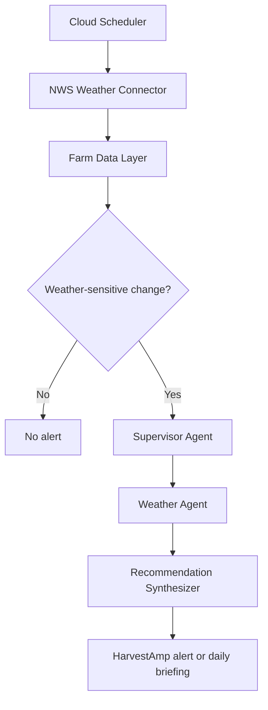
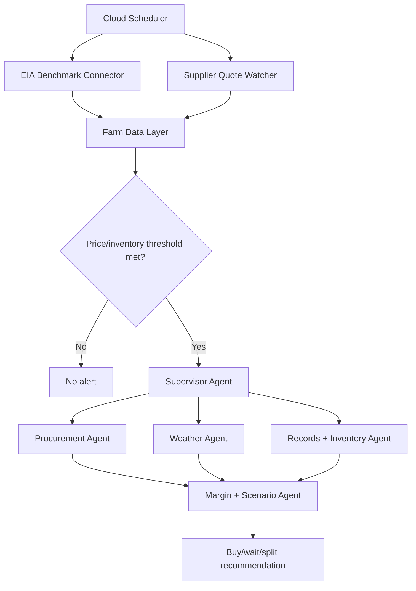
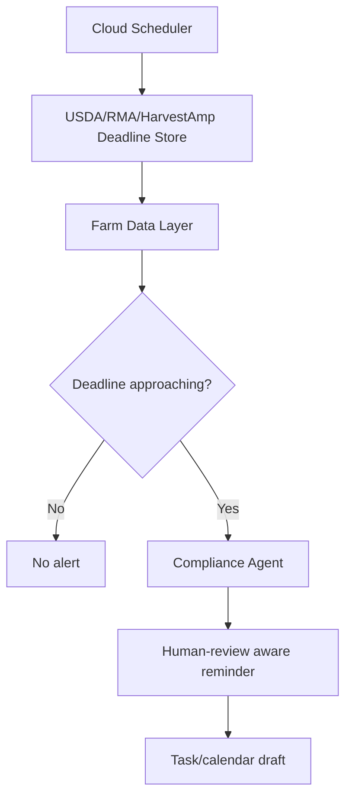

# 04_DATA_SOURCES.md

# Data Sources: HarvestAmp

**Version:** 0.2  
**Date:** 2026-06-22  
**Status:** Draft MVP planning document  
**Product name:** HarvestAmp  
**Related documents:** `01_PRODUCT_BRIEF.md`, `02_AGENT_ARCHITECTURE.md`, `03_FARM_PROFILES.md`  
**Intended use:** Source-of-truth data-source inventory for Antigravity tasks, connector planning, agent contracts, sample scenarios, privacy reviews, and MVP implementation planning.

---

## 0. Revision Notes

### 0.2 HarvestAmp rename

Updated the working product name to **HarvestAmp** across the live source-of-truth documents. Data-source strategy remains unchanged.

---

## 0. Important Note

This document is a planning document, not an implementation file.

It identifies candidate data sources for HarvestAmp's MVP and later roadmap. Every source, API, endpoint, license, price, access method, rate limit, credential requirement, and terms-of-use requirement must be verified again before implementation.

HarvestAmp must not treat any public, third-party, supplier, or user-uploaded data source as automatically complete, current, or legally sufficient. Agricultural, pesticide, organic, insurance, marketing, veterinary, tax, legal, and regulatory decisions require appropriate human review.

---

## 1. Purpose of This Document

HarvestAmp depends on reliable data. The agents should not wander the open web randomly. HarvestAmp should use explicit data connectors, approved tools, user-authorized integrations, uploaded documents, manual entries, and farm records.

This document defines:

- Which data sources HarvestAmp should use in the MVP.
- Which data sources are authoritative, benchmark-only, supplier-specific, or user-entered.
- Which agents use each data source.
- How often each source should be refreshed.
- Which privacy class each source belongs to.
- Which sources require credentials, authorization, or human review.
- Which sources should be mocked first before real integration.
- Which data sources are intentionally excluded from the MVP.

The goal is to make later Antigravity tasks precise. Any task that builds a connector, agent, monitoring loop, or UI card should read this file before making data-source assumptions.

---

## 2. Core Data Strategy

HarvestAmp should follow this pattern:

> Trusted sources feed a normalized farm data layer. Monitoring rules detect relevant changes. Agents receive task-scoped data packages. Recommendations cite evidence, freshness, assumptions, and confidence. High-risk actions require human approval.

HarvestAmp should **not** be designed as an agent that constantly browses the open web. Browsing can be used for controlled research tasks, but production decision support should rely on explicit connectors and auditable source records.

### 2.1 Data-source principles

1. **Task-scoped access**  
   Agents receive only the data required for the active workflow.

2. **Trusted-source preference**  
   Prefer official APIs, farm-owned records, authorized supplier quotes, and known extension resources over general web search.

3. **Source timestamping**  
   Every imported observation must include retrieval time, source publication time if available, and freshness status.

4. **Evidence-first recommendations**  
   Agent findings should include references to the data used, not just a final recommendation.

5. **Supplier quotes override benchmarks**  
   Public price benchmarks are useful context, but a farm's real supplier quote is usually more actionable.

6. **No raw credentials in agent context**  
   API keys, OAuth refresh tokens, passwords, supplier portal credentials, and private keys must be handled by the Credential Broker / Authorization Service and never placed into LLM prompts.

7. **No cross-farm leakage**  
   HarvestAmp must never use one farm's private data to answer another farm's question unless the workflow is explicitly authorized and aggregated/de-identified.

8. **Human review for regulated or high-impact data**  
   Pesticide labels, organic compliance, crop insurance, USDA filings, livestock health, major purchases, and marketing decisions must use human-in-the-loop controls.

---

## 3. Data Intake Levels

HarvestAmp should build data access in levels. This prevents early development from getting stuck on difficult supplier integrations.

| Level | Name | Description | MVP role |
|---|---|---|---|
| L0 | Synthetic test data | Stable mock data from `03_FARM_PROFILES.md` and `07_SAMPLE_SCENARIOS.md` | Required first |
| L1 | Manual entry | User enters quotes, inventory, crop dates, tank levels, market notes, and supplier details | Required for MVP |
| L2 | Uploaded documents | User uploads PDFs, images, invoices, quotes, seed orders, organic records, labels, and spreadsheets | Required for MVP |
| L3 | Public official APIs | Weather, fuel benchmarks, USDA market data, NASS statistics, soil data, program dates | MVP where feasible |
| L4 | Google Workspace integrations | Gmail quote parsing, Drive file import, Calendar reminders | Strong early extension |
| L5 | Supplier/partner integrations | Co-op, ag retailer, seed dealer, fuel distributor, packaging supplier, farm-management platform | Post-MVP / enterprise |
| L6 | Sensor/equipment integrations | Fuel tank sensors, weather stations, irrigation sensors, telematics, IoT devices | Later roadmap |
| L7 | Premium data feeds | Paid market data, basis feeds, fertilizer price feeds, weather analytics, crop risk analytics | Later roadmap |

### 3.1 MVP intake recommendation

For the first MVP, HarvestAmp should support:

- L0 synthetic test data.
- L1 manual price and inventory entry.
- L2 upload of quotes, invoices, and field notes.
- L3 public weather, energy benchmark, USDA market/statistical sources where feasible.
- Limited L4 Google Calendar task/reminder integration if the architecture is ready.

Supplier integrations should be designed, but not required, for the first demonstration.

---

## 4. Data Sensitivity Classes

Use the sensitivity classes from `02_AGENT_ARCHITECTURE.md`.

| Class | Meaning | Examples | LLM access rule |
|---|---|---|---|
| Public | Already public or non-sensitive | Public weather, public USDA reports, public extension bulletins | Allowed when relevant |
| Farm Internal | Operational but lower sensitivity | Internal task lists, general crop calendars, maintenance reminders | Allowed for authorized users and relevant tasks |
| Farm Confidential | Commercially sensitive farm operations | Field boundaries, acreage, inventory, supplier names, crop plans, tank levels | Minimize and task-scope |
| Farm Restricted | Highly sensitive commercial or compliance data | Supplier quotes, invoices, contracts, break-even, margin scenarios, insurance documents, organic records | Strictly task-scoped, redact where possible |
| Credentials and Secrets | Must never reach LLM prompts | Passwords, API keys, OAuth tokens, supplier portal credentials, private keys | Never allowed in prompts or agent memory |

---

## 5. Source Trust Tiers

HarvestAmp should label data sources by trust tier.

| Trust tier | Description | Examples | How agents should use it |
|---|---|---|---|
| T1 Official / primary | Government, official API, farm-owned system, or direct supplier record | NWS weather API, USDA AMS API, EIA API, uploaded supplier quote | Preferred evidence source |
| T2 Authorized partner | Data from approved vendor, co-op, ag retailer, advisor, or paid provider | Co-op fertilizer feed, fuel distributor feed, premium commodity feed | Use if authorized and timestamped |
| T3 User-entered | Data typed by user or imported from their files | Manual fuel quote, tank level, packaging inventory | Useful but may need confirmation |
| T4 Curated advisory | Extension, university, Crop Protection Network, certifier list, advisor notes | Crop scouting bulletins, disease maps, certifier input list | Advisory evidence, not automatic final decision |
| T5 General web / unverified | Open web content without known authority or freshness | Random blogs, social posts, price rumors | Avoid for recommendations; use only for low-risk research with citation and warnings |

---

## 6. Data Source Registry

The table below is the planning registry for MVP and early roadmap sources.

| ID | Domain | Source | Main use | Intake method | MVP priority | Privacy class | Main agents |
|---|---|---|---|---|---|---|---|
| DS-001 | Farm profile | User onboarding and farm settings | Farm type, crops, livestock, fields, sales channels, suppliers, risk tolerance | Manual entry / UI | Required | Farm Confidential | Farm Profile, Supervisor, all agents |
| DS-002 | Field and crop records | HarvestAmp internal records | Planting dates, field status, crop stages, field notes | Manual entry / upload / future integration | Required | Farm Confidential | Weather, Crop Risk, Records, Synthesizer |
| DS-003 | Inventory records | HarvestAmp internal records | Fuel, fertilizer, seed, feed, packaging, parts, organic inputs | Manual entry / upload / future sensor | Required | Farm Confidential / Restricted | Procurement, Records, Margin |
| DS-004 | Supplier quotes | User-uploaded quotes or manual entries | Fuel, fertilizer, seed, feed, packaging, parts | Upload, manual entry, Gmail later | Required | Farm Restricted | Procurement, Margin, Synthesizer |
| DS-005 | Invoices and receipts | User-uploaded farm documents | Purchase history, cost tracking, inventory update | Upload / OCR / Document AI later | Required | Farm Restricted | Records, Procurement, Margin |
| DS-006 | Weather forecast | National Weather Service API | Forecasts, wind, rain, alerts, fieldwork windows | API | Required for U.S. MVP | Public | Weather, Crop Risk, Supervisor |
| DS-007 | Weather alerts | National Weather Service API | Severe weather, frost/freeze, storm alerts | API / scheduled polling | Required for U.S. MVP | Public | Weather, Livestock later, Synthesizer |
| DS-008 | Fuel benchmark | U.S. Energy Information Administration API | Diesel/propane benchmark trends | API | Required for fuel workflow | Public | Procurement, Margin |
| DS-009 | USDA market data | USDA AMS MyMarketNews API | Commodity, livestock, produce, market reports | API | High | Public | Market, Procurement, Synthesizer |
| DS-010 | Crop statistics | USDA NASS Quick Stats | Crop acreage, production, progress/context, historical benchmarks | API/download | Medium | Public | Market, Crop Risk, Farm Profile |
| DS-011 | Crop progress reports | USDA NASS / ESMIS reports | Weekly state crop progress and condition context | Report ingestion / API if available | Medium | Public | Market, Crop Risk |
| DS-012 | Crop issue alerts | Crop Protection Network Crop Lookout and tools | Regional crop disease/pest scouting context | Curated connector / manual source list | Medium | Public / Curated advisory | Crop Risk, Weather, Synthesizer |
| DS-013 | Pesticide labels | EPA PPLS / PPIS | Label lookup and compliance guardrails | Search / document retrieval | High for crop protection workflows | Public, but restricted use | Compliance, Crop Risk |
| DS-014 | Organic certification lookup | USDA Organic Integrity Database | Verify certified organic operations and supplier claims | Database / export / manual lookup | High for organic profile | Public / compliance-sensitive | Compliance, Procurement |
| DS-015 | Organic input approvals | Certifier-approved list, OMRI or equivalent, uploaded farm records | Organic input eligibility | User upload / partner integration / manual | Required for organic MVP as user-uploaded data | Farm Restricted | Compliance, Procurement |
| DS-016 | USDA deadlines | Farmers.gov, FSA, RMA, local service center | Acreage reporting, program deadlines, local contacts | Curated knowledge base / local office confirmation | High | Public / compliance-sensitive | Compliance, Synthesizer |
| DS-017 | Crop insurance dates/data | USDA RMA tools and actuarial documents | Sales closing, planting, reporting, filing dates, insurance context | API/report ingestion/manual | Medium | Public / compliance-sensitive | Compliance, Market |
| DS-018 | Soils | USDA NRCS Web Soil Survey / Soil Data Access | Field soil context, drainage, management notes | API/web service / GIS import | Medium | Public plus farm location sensitivity | Weather, Crop Risk, Farm Profile |
| DS-019 | Google Gmail | User-authorized supplier emails | Quote extraction, invoices, supplier communications | OAuth integration | Post-MVP or MVP extension | Farm Restricted / Credentials isolated | Procurement, Records, Action Agent |
| DS-020 | Google Drive | User-authorized document storage | Import quotes, invoices, organic docs, reports | OAuth integration | Post-MVP or MVP extension | Farm Restricted / Credentials isolated | Records, Compliance |
| DS-021 | Google Calendar | User-authorized reminders | Tasks, deadlines, fieldwork reminders, market days | OAuth integration | Optional MVP extension | Farm Internal / Confidential | Action Agent, Records |
| DS-022 | Supplier portals | Co-ops, ag retailers, fuel distributors, seed dealers | Live local prices, quotes, contracts, delivery info | Partner API / credentialed connector | Post-MVP | Farm Restricted / Credentials isolated | Procurement |
| DS-023 | Farm-management platforms | Existing farm records | Fields, operations, inventory, yield, equipment | Partner API / import | Later roadmap | Farm Confidential / Restricted | Records, Weather, Crop Risk |
| DS-024 | Sensor/equipment data | Tank sensors, weather stations, irrigation, telematics | Real-time inventory, field conditions, equipment usage | IoT integration | Later roadmap | Farm Confidential | Records, Weather, Procurement |
| DS-025 | Direct-market sales records | POS, CSA, farmers market logs | Sales history, inventory, market planning | Manual/import/POS integration | Required as manual data for Green Basket | Farm Restricted | Market, Records, Margin |
| DS-026 | Customer/customer-channel data | CSA members, restaurant buyers, wholesale contacts | Availability sheets, delivery, customer messages | Manual/import | Optional MVP | Farm Restricted | Market, Action Agent |
| DS-027 | Extension and university resources | State extension bulletins and local crop guidance | Local scouting and pest/disease context | Curated source list | Medium | Public / Curated advisory | Crop Risk, Compliance |
| DS-028 | Product catalogs | Seed catalogs, packaging vendors, farm suppliers | Availability, product specs, ordering deadlines | Manual/upload/partner feed | Optional MVP | Public / Farm Restricted if quote-specific | Procurement |
| DS-029 | irrigation / water scheduling | Irrigation district / water district portal | Irrigation delivery windows, available water turns, requested start times, requested flow rates or volumes, allocation or balance status, turnout/gate/field identifiers, district/canal/provider schedule notes | manual entry / uploaded schedule / credentialed portal integration | Medium / Tier 2 Extension | Farm Restricted | Weather, Records, Compliance, Action, Credential Broker, Tool Gateway |
| DS-030 | irrigation / water records | Farm irrigation records | Irrigation events, applied water volume, field water history, pump/fuel/electricity notes, water-use recordkeeping, field/crop irrigation notes | manual entry / uploaded records / future sensor/portal integration | Medium / Tier 2 Extension | Farm Confidential / Restricted | Records |

---

## 7. MVP Source Detail

### 7.1 DS-001: Farm profile data

**Purpose:** Make HarvestAmp farm-specific.

HarvestAmp should collect and maintain:

- Farm name.
- Farm type.
- User roles.
- County, state, and approximate service area.
- Crops and livestock.
- Field names and approximate locations.
- Organic/conventional/transitioning status.
- Sales channels.
- Suppliers.
- Inventory categories.
- Risk tolerance.
- Human-review thresholds.
- Preferred data sources.

**Intake method:** UI onboarding, manual edits, future import from farm-management platforms.

**Privacy class:** Farm Confidential.

**LLM rule:** Provide only task-scoped farm profile details. Do not include full field boundaries or full supplier lists unless needed.

**MVP requirement:** Required.

---

### 7.2 DS-002: Field and crop records

**Purpose:** Let agents interpret weather, crop risk, procurement, and planning in context.

Examples:

- Field name.
- Crop.
- Planting date.
- Crop stage.
- Irrigated/dryland status.
- Recent fieldwork.
- Scouting observations.
- Photo notes.
- Planned operations.

**Intake method:** Manual entry, voice notes, upload, future farm-management integration.

**Privacy class:** Farm Confidential.

**Main users:** Weather Agent, Crop Risk Agent, Records Agent, Synthesizer.

**MVP requirement:** Required, using synthetic and manual data.

---

### 7.3 DS-003: Inventory records

**Purpose:** Make purchasing recommendations practical.

HarvestAmp should track inventory for:

- Fuel.
- Fertilizer.
- Seed.
- Feed/hay/bedding.
- Packaging.
- Organic inputs.
- Crop protection products.
- Parts and repairs.
- Market supplies.

**Intake method:** Manual entry, invoice extraction, future tank sensors or supplier feeds.

**Privacy class:** Farm Confidential; may become Farm Restricted when linked to supplier quotes, margins, or financial records.

**MVP requirement:** Required.

**Rule:** Do not recommend buying based on price alone. Check inventory, capacity, upcoming operational need, delivery lead time, and risk tolerance.

---

### 7.4 DS-004: Supplier quotes

**Purpose:** Anchor procurement recommendations to real local prices.

Quote data should include:

- Supplier.
- Product.
- Unit price.
- Unit of measure.
- Volume.
- Delivery fee.
- Application fee if relevant.
- Discount terms.
- Expiration date.
- Quote date.
- Contact person if provided.
- Product equivalence assumptions.

**Intake method:** Manual entry, upload, Gmail ingestion later, supplier integration later.

**Privacy class:** Farm Restricted.

**MVP requirement:** Required.

**Rule:** Supplier quotes are sensitive. Do not disclose one supplier's quote to another supplier unless the user explicitly approves that disclosure.

---

### 7.5 DS-005: Invoices and receipts

**Purpose:** Build cost history and update inventory.

Examples:

- Fuel invoice.
- Fertilizer invoice.
- Seed order.
- Packaging receipt.
- Equipment parts invoice.
- Organic input documentation.

**Intake method:** Upload and manual correction. Later: Gmail and Drive import.

**Privacy class:** Farm Restricted.

**MVP requirement:** Required as uploaded synthetic documents in tests.

**Recommended Google product:** Document AI or Vision OCR for extraction after MVP logic is stable.

---

### 7.6 DS-006 and DS-007: Weather forecasts and alerts

**Candidate source:** National Weather Service API  
**Official URL:** https://www.weather.gov/documentation/services-web-api

NWS states that its API provides access to forecasts, alerts, observations, and other weather data. It is based on JSON-LD and is designed with cache-friendly behavior tied to the information life cycle.

**Useful data:**

- Hourly forecast.
- Daily forecast.
- Gridpoint forecast data.
- Watches, warnings, advisories, and alerts.
- Observations.
- Rain probability.
- Temperature.
- Wind speed and direction.
- Heat/freeze risk.

**HarvestAmp use cases:**

- Spray-window assessment.
- Fieldwork planning.
- Frost/freeze alerts.
- Market-day weather.
- Livestock heat-risk monitoring later.
- Crop disease risk context.

**Refresh cadence:**

- On demand when user asks a weather-sensitive question.
- Scheduled every 1-3 hours during active growing/harvest periods.
- More frequent alert polling during severe weather windows.

**Privacy class:** Public source data, but farm-field location is Farm Confidential.

**MVP requirement:** Required.

**Important rule:** Weather data should be converted into operational risk, not displayed as generic forecast text only.

---

### 7.7 DS-008: Fuel benchmark data

**Candidate source:** U.S. Energy Information Administration Open Data API  
**Official URL:** https://www.eia.gov/opendata/documentation.php

EIA provides an API for energy data. For HarvestAmp, EIA data should be used as a benchmark for diesel, gasoline, propane, heating oil, and related energy markets where relevant.

**HarvestAmp use cases:**

- Diesel benchmark trend.
- Propane benchmark trend for greenhouse/heating or drying use.
- Comparison against farm's supplier quote.
- Fuel buy/wait/split scenarios.

**Refresh cadence:**

- Weekly for common diesel benchmark workflows.
- Daily only if using daily market series and the data justifies it.

**Privacy class:** Public.

**MVP requirement:** Required for Prairie View fuel workflow.

**Important rule:** EIA data is a benchmark. It is not the farmer's actual delivered farm diesel quote. HarvestAmp should anchor purchase decisions to supplier quotes, tank level, expected need, delivery lead time, and risk tolerance.

---

### 7.8 DS-009: USDA AMS MyMarketNews

**Candidate source:** USDA AMS MyMarketNews API  
**Official URL:** https://mymarketnews.ams.usda.gov/mymarketnews-api

USDA MyMarketNews provides an API that can be used to pull raw Market News data from USDA reports.

**HarvestAmp use cases:**

- Commodity market context.
- Livestock market context later.
- Produce market context for direct-market farms where relevant.
- Regional input cost reports where available.
- Market report summaries.

**Refresh cadence:**

- Daily or on report release for relevant reports.
- On demand for user market questions.

**Privacy class:** Public.

**MVP priority:** High.

**Important rule:** USDA market reports provide context, but local cash bids, basis, contracts, and direct-market prices may require user-entered, partner, or premium data.

---

### 7.9 DS-010 and DS-011: USDA NASS statistics and crop progress

**Candidate source:** USDA NASS Quick Stats API and downloadable data  
**Official URL:** https://www.nass.usda.gov/developer/index.php  
**Additional Quick Stats URL:** https://www.nass.usda.gov/Quick_Stats/

NASS says Quick Stats provides direct access to official statistical estimates related to agricultural production. Quick Stats can be queried by commodity, location, and time period.

**HarvestAmp use cases:**

- Crop acreage and production context.
- Historical county/state benchmarks.
- Crop progress and crop condition context where available.
- Market and regional status summaries.

**Refresh cadence:**

- Weekly where reports are weekly.
- Monthly/seasonally for historical estimates.
- On demand for benchmark queries.

**Privacy class:** Public.

**MVP priority:** Medium.

**Important rule:** NASS data is excellent for context, but not a replacement for the user's own fields, crop stage, inventory, quotes, or local bids.

---

### 7.10 DS-012: Crop issue alerts and crop protection context

**Candidate source:** Crop Protection Network Crop Lookout and tools  
**Official URL:** https://cropprotectionnetwork.org/crop-lookout

Crop Protection Network describes Crop Lookout as a real-time interactive map that highlights emerging field crop issues across the United States and Canada and is updated during the growing season by university Extension specialists and research partners.

**HarvestAmp use cases:**

- Scout-this-week recommendations.
- Regional pest/disease awareness.
- Crop issue watchlist.
- Crop risk summaries.

**Refresh cadence:**

- Daily during active growing season for relevant crops and regions if an integration is possible.
- Manual/curated review for early MVP if no API is available.

**Privacy class:** Public/curated advisory.

**MVP priority:** Medium.

**Important rule:** Crop issue maps and extension resources should trigger scouting suggestions, not definitive diagnosis or treatment instructions.

---

### 7.11 DS-013: Pesticide label and product data

**Candidate sources:**

- EPA Pesticide Product Label System (PPLS): https://www.epa.gov/pesticide-labels/pesticide-product-label-system-ppls-more-information
- EPA Pesticide Product Information System (PPIS): https://www.epa.gov/ingredients-used-pesticide-products/pesticide-product-information-system-ppis

EPA describes PPLS as a searchable system for pesticide labels, including product/brand names, active ingredients, company names, and EPA registration numbers. EPA describes PPIS as containing information for pesticide products registered in the United States, including registrant, ingredients, toxicity category, product names, site/pest uses, pesticidal type, formulation code, and registration status.

**HarvestAmp use cases:**

- Compliance guardrails.
- Label lookup support.
- Restricted-use or registration-status flags.
- Human-review triggers.
- Spray-window context when product information is supplied.

**Refresh cadence:**

- On demand when a product is mentioned.
- Periodic cache refresh for products saved by a farm.

**Privacy class:** Public source, but farm use context is Farm Confidential/Restricted.

**MVP priority:** High for safety design; implementation can begin as a controlled lookup and human-review flag.

**Important rule:** HarvestAmp should not generate pesticide rates, tank mixes, or product recommendations without appropriate label review and qualified human review. The label is the controlling source.

---

### 7.12 DS-014 and DS-015: Organic certification and organic input data

**Candidate source:** USDA Organic Integrity Database  
**Official dataset URL:** https://agdatacommons.nal.usda.gov/articles/dataset/The_Organic_INTEGRITY_Database/24661722

USDA describes the Organic Integrity Database as a certified organic operations database containing current information about operations that may and may not sell as organic.

**HarvestAmp use cases:**

- Verify whether a supplier/operation is certified organic.
- Store organic certification records.
- Prepare documentation checklists.
- Flag organic compliance questions for human review.

**Other likely sources:**

- Farm's certifier-approved input list.
- User-uploaded organic system plan.
- User-uploaded certifier correspondence.
- OMRI or equivalent product lists, if licensed/allowed.
- Product labels and certificates supplied by vendors.

**Refresh cadence:**

- On demand when supplier certification is checked.
- Document uploads when farmer adds organic records.

**Privacy class:** Public for OID lookup; Farm Restricted for farm organic records, input lists, organic system plans, and certifier correspondence.

**MVP priority:** Required for Green Basket, initially through user-uploaded documents and manual flags.

**Important rule:** HarvestAmp must not make final organic certification decisions. Organic input questions should trigger certifier review unless the farm has an explicit verified certifier-approved list loaded.

---

### 7.13 DS-016: USDA deadlines and service-center context

**Candidate sources:**

- Farmers.gov Local Dashboard: https://farmers.gov/dashboard
- Farmers.gov Program Deadlines: https://www.farmers.gov/working-with-us/program-deadlines
- USDA Service Center Locator: https://www.farmers.gov/working-with-us/service-center-locator

Farmers.gov provides local dashboards with state/county agricultural data and USDA resources. USDA also notes that acreage reporting deadlines vary by crop, state, and county and that local FSA staff can provide maps and acreage reporting deadlines by crop for the county.

**HarvestAmp use cases:**

- Local USDA office reminders.
- Acreage reporting reminders.
- Program-deadline watchlists.
- Contact details for USDA service centers.
- Human-review trigger for official filings.

**Refresh cadence:**

- Daily for deadline watchlist.
- On demand for county/service-center lookup.

**Privacy class:** Public source; user's participation and deadlines are Farm Restricted.

**MVP priority:** High.

**Important rule:** HarvestAmp should create reminders and checklists, but not submit official USDA or crop-insurance documents automatically in the MVP.

---

### 7.14 DS-017: Crop insurance data

**Candidate sources:**

- USDA RMA dates tools: https://public-rma.fpac.usda.gov/apps/MapViewer/dates.html
- USDA RMA actuarial documents: https://www.rma.usda.gov/tools-reports/actuarial-documents

USDA RMA provides tools and actuarial documents related to crop insurance. RMA date tools can show sales closing, planting, reporting, and filing dates by commodity, plan, type, practice, state, and county.

**HarvestAmp use cases:**

- Crop insurance date reminders.
- Human-review flags.
- Links to relevant RMA/local insurance agent resources.

**Refresh cadence:**

- At season setup.
- Daily deadline watch during critical windows.
- On demand when user asks insurance questions.

**Privacy class:** Public source; user's insurance participation, policy documents, and claims are Farm Restricted.

**MVP priority:** Medium.

**Important rule:** HarvestAmp should not interpret policy eligibility or claims as final. It should route users to their crop insurance agent or RMA/USDA resources.

---

### 7.15 DS-018: Soil data

**Candidate sources:**

- USDA NRCS Web Soil Survey: https://websoilsurvey.nrcs.usda.gov/
- USDA NRCS Soil Data Access: https://sdmdataaccess.nrcs.usda.gov/

USDA NRCS Web Soil Survey provides soil data and information produced by the National Cooperative Soil Survey. Soil Data Access provides web services for requesting and delivering soil survey spatial and tabular data.

**HarvestAmp use cases:**

- Field context.
- Drainage and soil limitation summaries.
- Crop-risk context.
- Irrigation and fieldwork context.
- Long-term farm profile enrichment.

**Refresh cadence:**

- On farm/field setup.
- Recheck occasionally or when field boundaries change.

**Privacy class:** Source data public; farm field boundaries and mapped field associations are Farm Confidential.

**MVP priority:** Medium, not required for first demo.

---

### 7.16 DS-019, DS-020, and DS-021: Google Workspace integrations

**Candidate sources:**

- Gmail API: https://developers.google.com/workspace/gmail/api/guides
- Google Drive API: https://developers.google.com/workspace/drive/api/guides/file-metadata
- Google Calendar API: https://developers.google.com/workspace/calendar/api/concepts/reminders

**HarvestAmp use cases:**

- Gmail: supplier quote emails, invoice emails, draft supplier messages.
- Drive: import quotes, invoices, organic records, field reports.
- Calendar: create reminders for tasks, deadlines, market days, fieldwork windows.

**Refresh cadence:**

- Event-driven where supported.
- Scheduled sync for authorized folders/labels.
- On demand when user asks to import a file or message.

**Privacy class:** Farm Restricted; credentials isolated.

**MVP priority:** Optional extension. Useful after the manual/upload workflows are validated.

**Important rules:**

- Use minimum OAuth scopes.
- Do not request broad mailbox or Drive access unless absolutely necessary.
- Prefer user-selected files, labels, folders, or messages.
- All external send actions require user approval.

---

### 7.17 DS-022: Supplier and partner integrations

**Candidate sources:**

- Co-ops.
- Ag retailers.
- Fuel distributors.
- Seed dealers.
- Feed mills.
- Packaging suppliers.
- Organic input suppliers.
- Equipment dealers.

**HarvestAmp use cases:**

- Live supplier quotes.
- Delivery availability.
- Contract/prepay status.
- Purchase history.
- Product availability.

**Intake method:** Partner API, EDI, secure file exchange, supplier portal integration, user-authorized email parsing, manual entry.

**Privacy class:** Farm Restricted; credentials isolated.

**MVP priority:** Post-MVP.

**Important rule:** Supplier integrations should not give suppliers access to the farm's inventory, competing quotes, margins, or purchase strategy unless the user explicitly authorizes disclosure.

---

### 7.18 DS-025 and DS-026: Direct-market sales and customer-channel data

**Candidate sources:**

- Manual sales logs.
- Farmers market receipts.
- CSA member lists.
- Restaurant buyer orders.
- Farm stand records.
- POS exports.
- Availability sheets.

**HarvestAmp use cases:**

- Market-day planning.
- Harvest lists.
- Packaging inventory.
- CSA box planning.
- Restaurant availability sheets.
- Margin estimates by product or market channel.

**Privacy class:** Farm Restricted, especially if customer names, emails, phone numbers, sales history, or pricing are included.

**MVP priority:** Required as manual/synthetic data for Green Basket.

**Important rule:** Customer-facing messages must require user approval before sending.

---

### 7.19 DS-029: Irrigation district / water district portal

- **Domain:** irrigation / water scheduling
- **Candidate sources / Name:** Water district / canal company / water association / provider portal.
- **Main use / HarvestAmp use cases:**
  - Irrigation delivery windows.
  - Available water turns.
  - Requested start times.
  - Requested flow rates or volumes.
  - Allocation or balance status.
  - Turnout / gate / field identifiers.
  - District / canal / provider schedule notes.
- **Intake method:**
  - Manual entry for MVP extension.
  - Uploaded schedule for MVP extension.
  - Credentialed portal integration post-MVP/pilot.
- **MVP priority:** Medium / Tier 2 Extension.
- **Privacy class:** Farm Restricted.
- **Trust tier:** T1 if official provider portal, T3 if user-entered, T2 if authorized partner.
- **Credential required:** Yes for portal access.
- **Main agents/services:**
  - Weather + Fieldwork Agent
  - Records + Inventory Agent
  - Compliance Agent
  - Action Agent
  - Credential Broker
  - Tool Gateway
- **Important rule:** Agents may summarize irrigation schedules and draft water requests, but real portal submission requires Credential Broker authorization, Tool Gateway mediation, user approval, and audit logging. Never ask for irrigation portal credentials in chat.

---

### 7.20 DS-030: Farm irrigation records

- **Domain:** irrigation / water records
- **Candidate sources / Name:** Farm irrigation logs / records.
- **Main use / HarvestAmp use cases:**
  - Irrigation events.
  - Applied water volume.
  - Field water history.
  - Pump / fuel / electricity notes.
  - Water-use recordkeeping.
  - Field / crop irrigation notes.
- **Intake method:**
  - Manual entry.
  - Uploaded records.
  - Future sensor / portal integration.
- **Privacy class:** Farm Confidential / Farm Restricted.
- **Important rule:** Irrigation records should be task-scoped and should not be exposed to unauthorized users.

---

## 8. Data by MVP Farm Profile

### 8.1 Prairie View Farms data needs

Prairie View Farms is the large conventional row-crop MVP profile.

| Workflow | Required data |
|---|---|
| Weekly farm action plan | Farm profile, fields, crop stages, weather, inventory, market context, deadlines |
| Fuel buy/wait/split | Supplier diesel quote, tank level, tank capacity, expected fieldwork, EIA benchmark, risk tolerance |
| Fertilizer quote comparison | Supplier quotes, product analysis, acres, target nutrient needs, delivery/application fees, inventory |
| Seed planning | Acres, crop plan, seed order, population targets, seed inventory, supplier terms |
| Spray window | Weather, crop stage, planned operation, label/human-review flags |
| Market context | Local bid if entered, USDA market data if available, futures/basis if integrated later, storage assumptions |
| USDA/crop insurance reminder | County, crops, program participation, deadlines, local service center/RMA sources |

**MVP data strategy:** Use synthetic farm records, manual/uploaded supplier quotes, NWS weather, EIA fuel benchmarks, USDA AMS/NASS where feasible, and manual local cash-bid placeholders.

---

### 8.2 Green Basket Organics data needs

Green Basket Organics is the small organic direct-market MVP profile.

| Workflow | Required data |
|---|---|
| Weekly direct-market plan | Crop list, harvest stage, market calendar, CSA schedule, weather, packaging inventory |
| Packaging check | Inventory, market schedule, expected sales, supplier quote/manual price |
| Organic input check | Product information, certifier-approved list or uploaded documentation, organic status, human-review flag |
| Market-day weather | Weather forecast, market location, sensitive products, canopy/tent supplies |
| CSA planning | Member count, box contents, harvest estimates, substitutions, customer messages |
| Seed ordering | Crop plan, bed feet, succession dates, organic seed availability, supplier catalog/manual quotes |
| Food-safety records | Wash/pack logs, harvest records, customer channel, human-review flags |

**MVP data strategy:** Use synthetic farm records, manual inventory entries, uploaded organic/input documents, uploaded packaging quotes, NWS weather, calendar tasks, and manual market sales logs.

---

## 9. Data Packages Sent to Agents

Agents should not receive entire database records. The Supervisor or Context Builder should assemble task-specific data packages.

### 9.1 Weather task package

```yaml
weather_task_package:
  farm_id: "synthetic_prairie_view"
  user_role: "farm_manager"
  task: "spray_window_assessment"
  field_context:
    field_id: "north_80"
    crop: "soybeans"
    planting_date: "2026-05-08"
    recent_status: "wet_after_rain"
  forecast:
    source: "NWS API"
    retrieved_at: "2026-06-22T08:00:00-05:00"
    valid_window: "next_72_hours"
    wind_summary: "morning lower, afternoon higher"
    rain_summary: "rain risk tomorrow night"
  privacy:
    data_classes: ["Public", "Farm Confidential"]
    redactions_applied: true
```

### 9.2 Procurement task package

```yaml
procurement_task_package:
  farm_id: "synthetic_prairie_view"
  task: "fuel_buy_window"
  input_category: "diesel"
  supplier_quote:
    source_type: "user_uploaded_quote"
    quote_date: "2026-06-20"
    unit_price: "synthetic"
    unit: "dollars_per_gallon"
    supplier_name_redacted_for_llm: false
  inventory:
    tank_level_percent: 38
    tank_capacity_gallons: 4000
  benchmark:
    source: "EIA API"
    retrieved_at: "2026-06-22T08:00:00-05:00"
    benchmark_type: "regional_on_highway_diesel"
  operational_need:
    expected_fieldwork_window: "next_7_days"
    expected_monthly_use: "synthetic_estimate"
  privacy:
    data_classes: ["Farm Restricted", "Farm Confidential", "Public"]
    external_disclosure_allowed: false
```

### 9.3 Organic input task package

```yaml
organic_input_task_package:
  farm_id: "synthetic_green_basket"
  task: "organic_input_check"
  product:
    name: "synthetic_liquid_fertilizer"
    supplier: "synthetic_supplier"
    document_source: "uploaded_quote_pdf"
  organic_records:
    certifier_approved_list_available: false
    uploaded_document_available: true
  human_review:
    required: true
    review_type: "expert_review"
    recommended_reviewer:
      - "organic_certifier"
      - "farm_owner"
  privacy:
    data_classes: ["Farm Restricted"]
```

---

## 10. Freshness and Staleness Rules

Every data item should include freshness metadata.

```yaml
data_observation:
  observation_id: "obs_123"
  source_id: "DS-008"
  source_name: "EIA Open Data API"
  retrieved_at: "2026-06-22T08:00:00-05:00"
  source_published_at: "2026-06-17T00:00:00-05:00"
  valid_until: "2026-06-24T00:00:00-05:00"
  freshness_status: "fresh | acceptable | stale | unknown"
  trust_tier: "T1 Official / primary"
  privacy_class: "Public"
```

### 10.1 Suggested freshness policies

| Data type | Freshness target | Stale after | Notes |
|---|---:|---:|---|
| Weather forecast | On demand / 1-3 hours | 6 hours for operational decisions | Refresh before weather-sensitive recommendation |
| Weather alerts | 15-60 minutes during active risk | 1 hour | Severe alerts may need faster checks |
| Diesel benchmark | Weekly or source cadence | 10 days | Benchmark only; supplier quote more important |
| Supplier fuel quote | Quote expiration or 7 days | After quote expiration | If no expiration, ask user to confirm |
| Fertilizer quote | Quote expiration or 7-14 days | After quote expiration | Highly local and volatile |
| Seed quote | Quote expiration or season-dependent | After order deadline | Include availability/traits/treatments |
| Packaging quote | 30 days unless supplier says otherwise | 30-60 days | Small-farm operational risk if stock low |
| Inventory level | Event-based | When last update is too old for decision | Ask user to confirm when uncertain |
| USDA/NASS stats | Source cadence | Depends on report | Use for context, not immediate operations |
| USDA deadlines | Daily during active deadline windows | 7 days unless verified | Local office confirmation recommended |
| Organic input approval | Until certifier changes or document expires | Unknown if not verified | Certifier review required |
| Pesticide label | On demand/current label | Unknown if cached | Retrieve current label before use |

---

## 11. Data Normalization Rules

HarvestAmp should normalize data before agents reason over it.

### 11.1 Units

Normalize common units:

- Fuel: gallons, dollars per gallon.
- Fertilizer: dollars per ton, dollars per gallon, dollars per acre, dollars per pound of nutrient.
- Seed: dollars per bag, dollars per unit, acres covered, population assumptions.
- Feed/hay: dollars per ton, dollars per bale, pounds per head per day.
- Packaging: dollars per case, dollars per unit, units on hand, units per market/CSA week.
- Commodity sales: dollars per bushel, dollars per hundredweight, dollars per pound, dollars per box.
- Weather: Fahrenheit, inches, mph, direction, probability.

### 11.2 Source evidence

All normalized observations should preserve the original source evidence.

```yaml
source_evidence:
  evidence_id: "ev_123"
  source_id: "DS-004"
  source_name: "uploaded supplier quote"
  original_file_id: "file_synthetic_001"
  extracted_field: "urea_price_per_ton"
  extracted_value: "synthetic"
  extraction_confidence: "medium"
  human_verified: false
  retrieved_at: "2026-06-22T08:00:00-05:00"
```

### 11.3 Confidence rules

Agent confidence should be reduced when:

- Data is stale.
- Data sources conflict.
- A quote is missing delivery or application fees.
- Units cannot be normalized confidently.
- The farm profile is incomplete.
- Required inventory is missing.
- A recommendation depends heavily on a weather forecast.
- A regulatory/compliance issue is involved.

---

## 12. Connector Ownership by Agent

Connectors are not owned by LLM agents. Agents request data through the Tool Gateway.

| Connector/tool | Primary owner | Agents that use it | Human/credential control |
|---|---|---|---|
| Farm Profile Store | HarvestAmp app backend | All agents | User/account auth required |
| Inventory Store | HarvestAmp app backend | Procurement, Records, Margin | User/account auth required |
| Upload Parser | Records system / Document AI later | Records, Procurement, Compliance | User upload authorization |
| NWS Weather Connector | Data layer | Weather, Crop Risk | No user credential; field location scoped |
| EIA Fuel Connector | Data layer | Procurement, Margin | API key stored outside agent context |
| USDA AMS Connector | Data layer | Market, Procurement | API key stored outside agent context if required |
| USDA NASS Connector | Data layer | Market, Crop Risk | API key if required; public data |
| EPA Label Connector | Compliance layer | Compliance, Crop Risk | Public lookup; high-risk output gate |
| Organic Data Connector | Compliance layer | Compliance, Procurement | Source-specific access; human-review gate |
| Gmail Connector | Credential Broker + Tool Gateway | Procurement, Records, Action Agent | OAuth; minimum scopes; user approval before send |
| Drive Connector | Credential Broker + Tool Gateway | Records, Compliance | OAuth; folder/file scoped where possible |
| Calendar Connector | Credential Broker + Tool Gateway | Action Agent, Records | OAuth; user approval for event creation if configured |
| Supplier Connector | Credential Broker + Tool Gateway | Procurement | Partner contract, OAuth/API key, no raw credentials in prompts |

---

## 13. Google Cloud and Google AI Infrastructure Data Components

HarvestAmp should use Google Cloud services to manage data movement, credentials, and monitoring.

| Component | Recommended role |
|---|---|
| Secret Manager | Store API keys, OAuth secrets, supplier credentials, and service credentials outside LLM context |
| Sensitive Data Protection | Inspect, classify, redact, mask, or de-identify sensitive content before storage, prompts, or logs |
| Cloud Scheduler | Run scheduled checks for weather, fuel benchmarks, deadlines, stale inventory, and market reports |
| Pub/Sub | Pass connector events and monitoring triggers between independent services |
| Cloud Storage | Store uploaded documents, raw extracts, and source snapshots with retention controls |
| Firestore or Cloud SQL | Store farm profiles, inventory, tasks, quotes, recommendations, permissions, and workflow state |
| BigQuery | Store analytics, evaluation logs, source freshness metrics, de-identified aggregates |
| Document AI | Later: extract structured data from invoices, quotes, receipts, organic documents, and scanned forms |
| Cloud Vision | Later: OCR/image extraction for photos or basic image documents; crop image triage should be separate and cautious |
| Vertex AI / Gemini | Reasoning, summarization, recommendation synthesis, document understanding after redaction/context scoping |
| ADK | Agent orchestration and tool use |

---

## 14. Monitoring Loops by Data Source

### 14.1 Weather monitoring loop



### 14.2 Fuel-price monitoring loop



### 14.3 Compliance/deadline monitoring loop



---

## 15. Data Source Acceptance Criteria

A data connector is not MVP-ready unless it satisfies these criteria.

### 15.1 Required metadata

Every connector output must include:

- Source ID.
- Source name.
- Retrieval time.
- Publication time if available.
- Data freshness status.
- Trust tier.
- Privacy class.
- Farm ID if farm-specific.
- User/account authorization status if private.
- Evidence reference or source URL/file ID.
- Extraction confidence if parsed from a document.
- Any missing fields or assumptions.

### 15.2 Required safety behavior

Connectors must:

- Reject unauthorized farm access.
- Avoid cross-tenant data retrieval.
- Avoid exposing credentials to agents.
- Redact or minimize sensitive data before prompts.
- Mark stale or incomplete data.
- Log sensitive data access.
- Respect user revocation of integrations.
- Preserve source evidence for auditability.

### 15.3 Required failure behavior

When a source fails, HarvestAmp should not hallucinate missing data.

Allowed behavior:

- Say the source is unavailable.
- Use cached data only if clearly labeled as cached/stale.
- Ask the user to confirm a quote, tank level, deadline, or inventory value.
- Downgrade confidence.
- Skip high-risk recommendations until data is available.

---

## 16. MVP Data-Source Build Order

Recommended order for Antigravity tasks:

1. **Synthetic data loader** for `03_FARM_PROFILES.md`.
2. **Farm profile and inventory store** with mock data.
3. **Source metadata model**: source ID, trust tier, freshness, privacy class.
4. **Manual quote/inventory entry screens or test fixtures**.
5. **Document upload and extraction stub** using synthetic extracted fields.
6. **NWS Weather Connector**.
7. **EIA Fuel Benchmark Connector**.
8. **USDA AMS / NASS connector spike** for market/statistical context.
9. **Compliance knowledge-base stub** for USDA deadlines, organic review flags, and pesticide label review flags.
10. **Google Calendar reminder integration** only after authorization controls exist.
11. **Gmail/Drive integration** only after Credential Broker, OAuth scopes, and privacy review are implemented.
12. **Supplier integrations** after MVP workflows have proven value.

---

## 17. Sources Excluded From MVP

HarvestAmp should not rely on the following in the MVP:

| Source type | Reason |
|---|---|
| Random web search for prices | Local price data is often stale, incomplete, or not comparable |
| Social media crop reports | Hard to verify, may be anecdotal, privacy risk |
| Automated commodity trading feeds/actions | High financial risk and regulatory complexity |
| Bank account data | Not required for MVP and adds major security/compliance burden |
| Automatic pesticide-rate recommendation tools | High safety and compliance risk |
| Automatic organic approval decisions | Certifier review required |
| Automatic government-form submission | Compliance risk; use reminders/checklists only |
| Unapproved scraping of supplier portals | Terms-of-use, security, and reliability risk |
| Neighbor or competitor farm data | Privacy, ethics, and trust risk |

---

## 18. Open Data Questions

These questions should be resolved before implementation or enterprise launch.

1. Which country/region is the first supported market? This document assumes a U.S.-first MVP.
2. Which weather provider should be used outside the United States?
3. Which public market datasets best support Prairie View's local grain workflow?
4. Should local cash bids be manual entry, partner feed, or paid data provider for MVP?
5. Which fertilizer price benchmarks are available and legally usable by region?
6. Are supplier quote uploads enough for fertilizer/seed/fuel MVP value?
7. Which Google Workspace scopes are acceptable for early users?
8. Does the MVP need Gmail ingestion, or are uploads/manual entry enough?
9. How will HarvestAmp validate an organic certifier-approved input list?
10. Which data must be retained for audit versus deleted quickly for privacy?
11. What retention period should apply to uploaded quotes, invoices, and extracted fields?
12. What data can be used for synthetic demos, evaluation tests, and model evaluation?
13. Should HarvestAmp support user-level, farm-level, and advisor-level data sharing in MVP?
14. What integration path is most likely for co-ops and ag retailers: API, CSV export, email, or portal?
15. Which pricing data sources can legally be used in a commercial Marketplace agent?

---

## 19. Antigravity Task Instructions

When using Antigravity to build any HarvestAmp data component, include this instruction:

```text
Read 01_PRODUCT_BRIEF.md, 02_AGENT_ARCHITECTURE.md, 03_FARM_PROFILES.md, and 04_DATA_SOURCES.md.
Use HarvestAmp as the product name.
Use only data sources and assumptions listed in 04_DATA_SOURCES.md unless you update the document.
Do not let agents browse the open web for production decisions.
Every connector output must include source ID, timestamp, trust tier, freshness status, privacy class, and evidence reference.
No credentials, API keys, passwords, OAuth tokens, or supplier portal secrets may enter LLM prompts, logs, or agent memory.
Use synthetic data first; add real connectors only after the data-source contract is stable.
```

---

## 20. Summary

HarvestAmp's data strategy should be controlled, auditable, and farm-specific.

For the MVP, HarvestAmp should use:

- Synthetic data from `03_FARM_PROFILES.md`.
- Manual farm profile and inventory entries.
- User-uploaded quotes and invoices.
- Public official weather and benchmark sources.
- Select USDA market, crop, and deadline resources.
- Organic and pesticide sources only as compliance-aware references with human-review gates.

The most important product rule is:

> HarvestAmp should not merely collect data. It should know which data is authoritative, which data is only a benchmark, which data is private, which data is stale, which data requires human review, and which data should never be exposed to an LLM.
