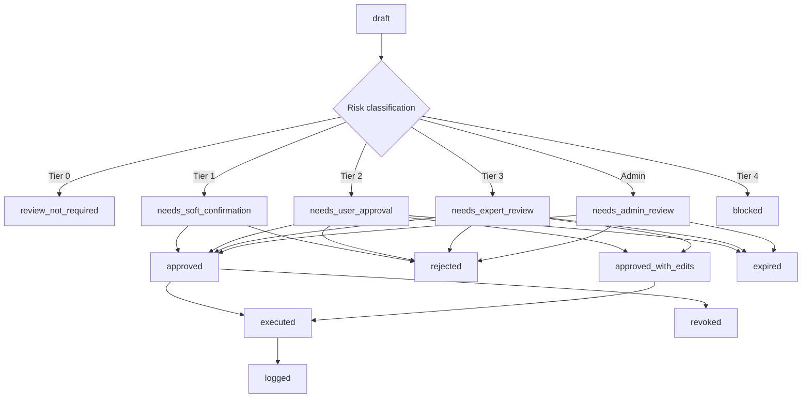

# 06_RISK_AND_HUMAN_REVIEW_POLICY.md

# Risk and Human Review Policy: HarvestAmp

**Version:** 0.1  
**Date:** 2026-06-22  
**Status:** Draft MVP planning document  
**Product name:** HarvestAmp  
**Related documents:** `01_PRODUCT_BRIEF.md`, `02_AGENT_ARCHITECTURE.md`, `03_FARM_PROFILES.md`, `04_DATA_SOURCES.md`, `05_AGENT_CONTRACTS.md`  
**Intended use:** Source-of-truth policy document for risk classification, human-in-the-loop gates, expert review triggers, approval flows, Action Agent constraints, evaluation tests, and future machine-readable policy configuration.

---

## 0. Important Note

This document is a planning document, not legal, agronomic, veterinary, financial, insurance, tax, or compliance advice.

HarvestAmp is a decision-support system. It may analyze, summarize, compare, draft, flag, and recommend scenarios. It must not make final regulated, safety-sensitive, legal, financial, crop-insurance, pesticide, veterinary, organic-certification, or binding commercial decisions on behalf of a user without the appropriate human approval or expert review.

All farm examples, thresholds, names, prices, quotes, inventory values, records, and users referenced in the MVP documents are synthetic unless explicitly connected to a real authorized customer environment in the future.

---

## 1. Purpose of This Document

The purpose of this document is to define when HarvestAmp must involve a human before taking, recommending, or escalating an action.

This document answers:

- What can HarvestAmp do automatically?
- What can HarvestAmp recommend but not execute?
- What requires user approval?
- What requires expert or responsible-human review?
- What requires admin approval?
- What must be blocked?
- What approval states should be stored?
- What risk metadata must agents return?
- What does the Action Agent need to check before doing anything external?
- How should HarvestAmp handle low confidence, missing data, stale data, conflicting evidence, or sensitive data disclosure?
- How should the risk policy apply to the two MVP farm profiles?

The goal is to make human-in-the-loop behavior consistent across separately built HarvestAmp agents.

---

## 2. Policy Summary

HarvestAmp uses **risk-based human review**.

The core policy is:

> HarvestAmp may analyze, summarize, compare, draft, and recommend. HarvestAmp must not commit, send, purchase, disclose, file, apply, delete, grant access, or execute high-impact external actions without the appropriate human approval.

The most important rule for implementation is:

> The Recommendation Synthesizer may produce recommendations. The Action Agent may execute only actions that have passed the required human-review state.

Human review is required whenever a recommendation or action could create:

- Financial loss.
- Regulatory risk.
- Safety risk.
- Crop or livestock damage.
- Organic certification risk.
- Food safety risk.
- Crop insurance or USDA program risk.
- Legal, tax, payroll, or contract risk.
- Privacy or commercial-confidentiality risk.
- Supplier relationship risk.
- Irreversible record changes.
- External disclosure of farm data.
- Unauthorized access or credential exposure.

HarvestAmp should avoid heavy approval gates for low-risk informational tasks. The system should be helpful without being reckless.

---

## 3. Core Principle

Use this principle across the product:

> The agent can prepare. The human decides. The system logs what happened.

HarvestAmp should provide:

- Evidence.
- Assumptions.
- Missing data.
- Confidence level.
- Review requirement.
- Recommended reviewer.
- Allowed next actions.
- Blocked next actions.

HarvestAmp should not present high-risk outputs as final instructions.

---

## 4. Definitions

### 4.1 Recommendation

A recommendation is a HarvestAmp-generated suggestion, scenario, alert, or next-best-action proposal.

Examples:

- Consider buying part of the expected diesel need this week.
- Scout early-planted soybean fields first.
- Compare these fertilizer quotes by cost per pound of nitrogen.
- Prepare a CSA member message about this week's box.
- Review organic status before using this input.

### 4.2 Action

An action is a system operation that changes state, sends information, contacts an external party, or creates a commitment.

Examples:

- Send an email to a supplier.
- Create a purchase order.
- Share a report with an advisor.
- Update official inventory.
- Mark a compliance task complete.
- Add a calendar event.
- Submit or prepare a form for filing.
- Grant access to a user.
- Delete a document.

### 4.3 External action

An external action sends data or instructions outside the HarvestAmp user interface or changes another system.

Examples:

- Emailing a fuel supplier.
- Sharing a fertilizer comparison with a crop advisor.
- Posting a farmers market availability list.
- Sending a CSA newsletter.
- Updating a Google Calendar.
- Pushing a task to a farm-management system.
- Uploading a document to a shared Drive folder.

### 4.4 Official record

An official record is a record that may affect compliance, accounting, crop insurance, certification, legal duties, customer obligations, or farm operations.

Examples:

- Organic certification records.
- Spray logs.
- Crop insurance documents.
- Acreage reports.
- Food safety records.
- Employee payroll records.
- Contracts.
- Signed supplier agreements.
- Customer data exports.

### 4.5 Expert review

Expert review means review by a qualified or responsible person outside the general-purpose AI workflow.

Depending on the case, this may be:

- Agronomist.
- Crop advisor.
- Certified crop advisor.
- Licensed pesticide applicator.
- Organic certifier.
- Veterinarian.
- Crop insurance agent.
- USDA/FSA office representative.
- Food safety professional.
- Accountant.
- Attorney.
- Farm owner or responsible farm manager.

### 4.6 Responsible human

A responsible human is the person authorized to make the relevant decision for the farm.

Examples:

- Farm owner.
- Farm manager.
- Purchasing manager.
- Market manager.
- Certification manager.
- Account administrator.
- Authorized advisor acting within explicit permissions.

### 4.7 Blocked action

A blocked action is an action HarvestAmp should not execute, even if an ordinary user asks for it.

Examples:

- Reveal one farm's private data to another farm.
- Send raw credentials to an LLM.
- Execute commodity trades.
- Make binding legal claims.
- Submit government forms without explicit approved workflow.
- Purchase restricted products automatically.
- Provide definitive pesticide rate instructions as final advice.
- Use customer data for model training without authorization.

---

## 5. Human Review Types

HarvestAmp should use these review types in structured output.

| Review type | Meaning | Example |
|---|---|---|
| `none` | No human approval required beyond normal display to an authorized user | Weather summary, public market summary |
| `soft_confirmation` | User may confirm or edit, but action is low risk | Add suggested scout task to internal list |
| `user_approval` | Authorized farm user must approve before action | Send supplier quote request, create purchase reminder |
| `expert_review` | Expert or responsible reviewer should confirm before relying on output | Pesticide label interpretation, organic input uncertainty |
| `admin_review` | Farm owner/admin must approve access, credential, export, deletion, or permission change | Add co-op advisor access to farm records |
| `blocked` | HarvestAmp should refuse, prevent, or route outside the system | Reveal another farm's quote, execute trade, expose credential |

The review type should be chosen by the highest-risk element in the recommendation or action.

---

## 6. Risk Tiers

HarvestAmp should classify recommendations and actions into five risk tiers.

### 6.1 Tier 0: Informational

**Approval requirement:** No explicit approval required.  
**Allowed behavior:** Display information to an authorized user.  
**Typical review type:** `none`.

Examples:

- Summarize today's weather.
- Show existing task list.
- Show public USDA or market information.
- Show previously entered fuel tank level to an authorized user.
- Summarize an uploaded quote without making a purchase recommendation.
- Display a dashboard card.

HarvestAmp must still respect authentication, authorization, data sensitivity, and tenant isolation.

### 6.2 Tier 1: Draft or Internal Assist

**Approval requirement:** Soft confirmation recommended, but not always required.  
**Allowed behavior:** Draft, organize, summarize, or add internal low-risk suggestions.  
**Typical review type:** `soft_confirmation`.

Examples:

- Draft an internal weekly task list.
- Suggest a scouting checklist.
- Extract fields from a fertilizer quote.
- Categorize an invoice as draft metadata.
- Create an internal watchlist item.
- Suggest possible market-day packing items.
- Flag a missing supplier quote.

Tier 1 actions should not send anything externally, create a purchase commitment, alter official records, or disclose sensitive data.

### 6.3 Tier 2: User Approval Required

**Approval requirement:** Authorized user approval required.  
**Allowed behavior:** Recommend, draft, queue action, and wait for approval.  
**Typical review type:** `user_approval`.

Examples:

- Draft and send a supplier email.
- Create a purchase order draft.
- Recommend buying fuel, fertilizer, seed, feed, or packaging.
- Recommend selling crops or livestock as a scenario.
- Send customer-facing messages.
- Update inventory from an invoice.
- Schedule operational tasks for a crew.
- Share a report with an advisor.
- Publish a farmers market availability list.

Tier 2 actions may be taken only after approval by an authorized user.

### 6.4 Tier 3: Expert or Responsible-Human Review Required

**Approval requirement:** Expert or responsible-human review required before relying on or executing.  
**Allowed behavior:** Provide decision support, flag risk, ask for missing data, prepare questions, and recommend review.  
**Typical review type:** `expert_review`.

Examples:

- Pesticide product, rate, label, tank mix, drift, re-entry, or pre-harvest interval questions.
- Organic input approval uncertainty.
- Livestock illness or veterinary treatment decisions.
- Nutrient-management recommendations beyond arithmetic comparison.
- Crop insurance, USDA program, or regulatory eligibility interpretation.
- Food safety contamination or recall risk.
- Legal, tax, contract, payroll, or lease interpretation.
- Major market, hedge, futures/options, or forward-contract decisions.

Tier 3 outputs should be framed as support for a human decision, not final instructions.

### 6.5 Tier 4: Blocked or Admin-Restricted

**Approval requirement:** Blocked or restricted to admin-governed workflows.  
**Allowed behavior:** Refuse, explain boundary, route to secure workflow, or escalate to admin.  
**Typical review type:** `blocked` or `admin_review`.

Examples:

- Reveal Farm A's private data to Farm B.
- Share supplier quotes with a competing supplier without explicit approval.
- Expose raw credentials, passwords, OAuth tokens, or API keys.
- Execute commodity trades.
- Submit government forms automatically without explicit approved workflow.
- Delete official records without admin confirmation.
- Grant access to restricted farm data without admin approval.
- Use customer data for model training, demos, or shared evaluation datasets without explicit authorization.
- Make final legal, tax, veterinary, pesticide, crop-insurance, or organic-certification determinations.

Blocked actions should be logged when appropriate.

---

## 7. Approval State Model

Every recommendation or action candidate should have an explicit approval state.

Recommended states:

```text
draft
review_not_required
needs_soft_confirmation
needs_user_approval
needs_expert_review
needs_admin_review
blocked
approved
approved_with_edits
rejected
expired
revoked
executed
logged
```

### 7.1 State transition model



### 7.2 State rules

- The Action Agent may execute only `review_not_required`, `approved`, or `approved_with_edits` actions.
- `needs_user_approval`, `needs_expert_review`, and `needs_admin_review` actions must not execute.
- `blocked` actions must not execute.
- `expired` approvals must be re-reviewed.
- `revoked` approvals must not be used.
- Approval should be tied to a specific action payload, not a vague intent.
- If the user edits the action payload, the risk classification should be rechecked.

---

## 8. Canonical Human Review Object

The `human_review` object is the shared structure used by specialist agents, the Supervisor, the Risk Gate, the Recommendation Synthesizer, the Action Agent, and future evaluation tests.

It should appear in `AgentFinding`, `Recommendation`, `ActionCandidate`, `ActionPack`, and `WorkItem` objects when relevant.

```yaml
human_review:
  required: true
  review_type: "user_approval | expert_review | admin_review | blocked | soft_confirmation | none"
  risk_tier: "tier_0 | tier_1 | tier_2 | tier_3 | tier_4"
  status: "draft | review_not_required | needs_user_approval | needs_expert_review | needs_admin_review | blocked | approved | approved_with_edits | rejected | expired | revoked | executed | logged"
  reason:
    - "financial_action"
    - "external_supplier_action"
    - "pesticide_related"
    - "organic_certification_sensitive"
    - "livestock_health_sensitive"
    - "crop_insurance_sensitive"
    - "usda_program_sensitive"
    - "food_safety_sensitive"
    - "legal_or_tax_sensitive"
    - "external_disclosure"
    - "permission_or_credential_change"
    - "destructive_record_change"
    - "low_confidence"
    - "missing_required_data"
    - "conflicting_sources"
    - "stale_data"
  recommended_reviewer:
    - "farm_owner"
    - "farm_manager"
    - "authorized_purchasing_user"
    - "agronomist"
    - "crop_advisor"
    - "organic_certifier"
    - "veterinarian"
    - "crop_insurance_agent"
    - "usda_fsa_representative"
    - "food_safety_professional"
    - "accountant"
    - "attorney"
    - "account_admin"
  approval_required_before:
    - "send_message"
    - "create_purchase_order"
    - "create_sale_commitment"
    - "update_official_record"
    - "share_report"
    - "publish_customer_message"
    - "grant_access"
    - "delete_record"
    - "execute_external_tool"
  confidence: "low | medium | high"
  missing_data:
    - "current tank level"
    - "confirmed supplier delivery fee"
  disclosure_preview_required: true
  approval_scope:
    applies_to_action_id: "action_candidate_id"
    expires_at: "ISO-8601 timestamp or null"
    recheck_required_if_payload_changes: true
```

### 8.1 Diesel-purchase example

```yaml
recommendation:
  title: "Consider buying 1,500 gallons of diesel this week"
  summary: "The current supplier quote is below the farm's recent average and a fieldwork window is expected next week. Buying part of the expected need now may reduce short-term operational risk."
  urgency: "medium"
  confidence: "medium"

human_review:
  required: true
  review_type: "user_approval"
  risk_tier: "tier_2"
  status: "needs_user_approval"
  reason:
    - "financial_action"
    - "external_supplier_action"
  recommended_reviewer:
    - "farm_owner"
    - "farm_manager"
  approval_required_before:
    - "send_message"
    - "create_purchase_order"
  confidence: "medium"
  missing_data:
    - "confirmed supplier delivery fee"
  disclosure_preview_required: true
```

### 8.2 Organic-input example

```yaml
recommendation:
  title: "Verify organic status before purchasing this fertilizer"
  summary: "The quote appears relevant to the crop plan, but the certifier-approved status is not confirmed."
  urgency: "high"
  confidence: "low"

human_review:
  required: true
  review_type: "expert_review"
  risk_tier: "tier_3"
  status: "needs_expert_review"
  reason:
    - "organic_certification_sensitive"
    - "compliance_sensitive"
    - "low_confidence"
  recommended_reviewer:
    - "organic_certifier"
    - "farm_owner"
  approval_required_before:
    - "create_purchase_order"
    - "update_official_record"
    - "apply_to_field_plan"
  confidence: "low"
  missing_data:
    - "certifier-approved input list"
    - "product label or supplier documentation"
  disclosure_preview_required: true
```

---

## 9. Future Machine-Readable Policy Shape

This document is Markdown. Later, HarvestAmp may translate policy rules into a configuration file such as:

```text
configs/human_review_rules.yaml
```

A future rule file may use a structure like this:

```yaml
policy_version: "harvestamp_human_review_v0_1"

defaults:
  external_send_requires_approval: true
  official_record_update_requires_approval: true
  raw_credentials_blocked: true
  cross_tenant_disclosure_blocked: true
  execute_trades_blocked: true

risk_tiers:
  tier_0:
    review_type: "none"
    can_execute_external_action: false
  tier_1:
    review_type: "soft_confirmation"
    can_execute_external_action: false
  tier_2:
    review_type: "user_approval"
    can_execute_external_action: true
    approval_required: true
  tier_3:
    review_type: "expert_review"
    can_execute_external_action: true
    approval_required: true
  tier_4:
    review_type: "blocked"
    can_execute_external_action: false

domain_rules:
  pesticide_related:
    minimum_tier: "tier_3"
    required_reviewer:
      - "agronomist"
      - "crop_advisor"
      - "licensed_applicator"
    blocked_final_claims:
      - "definitive_rate_instruction"
      - "guaranteed_label_compliance"
  organic_certification_sensitive:
    minimum_tier: "tier_3"
    required_reviewer:
      - "organic_certifier"
      - "farm_owner"
  financial_action:
    minimum_tier: "tier_2"
    required_reviewer:
      - "farm_owner"
      - "farm_manager"
  credential_exposure:
    minimum_tier: "tier_4"
    review_type: "blocked"
```

The implementation config should not be treated as complete until it is validated against `08_EVALUATION_TESTS.md`.

---

## 10. Universal Triggers for Human Review

Human review is required when any of the following are true.

### 10.1 Financial trigger

Triggered when HarvestAmp recommends or prepares an action that spends money, commits to buy, changes a purchase plan, sells products, changes sales timing, affects margin, or affects cash flow.

Examples:

- Buy diesel, propane, fertilizer, seed, feed, packaging, crop protection products, parts, or supplies.
- Choose Supplier A over Supplier B.
- Draft a supplier message that could lead to a purchase.
- Recommend selling stored grain or livestock.
- Change a marketing plan.
- Compare storage versus sale timing.
- Discuss hedging, futures, options, forward contracts, or risk-management instruments.

Minimum review type: `user_approval`.  
May require: `expert_review` for complex financial, hedging, or crop-marketing decisions.

### 10.2 External disclosure trigger

Triggered when HarvestAmp sends or shares farm data outside the authorized farm account.

Examples:

- Email supplier.
- Share a report with a co-op.
- Send a customer newsletter.
- Send a CSA update.
- Share organic documents with a certifier.
- Send crop records to an advisor.
- Export data to Drive, Sheets, or another third-party system.
- Post availability publicly.

Minimum review type: `user_approval`.

### 10.3 Regulated or compliance-sensitive trigger

Triggered when HarvestAmp handles a topic with regulatory, certification, insurance, safety, or legal implications.

Examples:

- Pesticide labels.
- Restricted-use products.
- Organic certification.
- Food safety.
- Crop insurance.
- USDA/FSA programs.
- Environmental compliance.
- Worker safety.
- Animal health.
- Contracts, leases, tax, payroll, or legal records.

Minimum review type: `expert_review` or `admin_review`, depending on the issue.

### 10.4 Permission, credential, or account trigger

Triggered when a user asks HarvestAmp to change access, connect an account, disconnect an account, export data, grant permission, revoke permission, store credentials, or delete data.

Minimum review type: `admin_review`.  
Raw credential exposure: `blocked`.

### 10.5 Low-confidence trigger

Triggered when:

- Required data is missing.
- Sources conflict.
- Data is stale.
- A source is untrusted.
- A forecast is highly uncertain.
- The farm profile is incomplete.
- The recommendation could materially affect money, compliance, safety, or privacy.

Minimum review type depends on domain, but the output must clearly say what is uncertain.

### 10.6 Irreversible or destructive action trigger

Triggered when an action deletes, overwrites, submits, or finalizes records.

Examples:

- Delete invoice.
- Delete certification document.
- Overwrite official spray record.
- Mark a compliance task as complete.
- Submit a government-related document.
- Revoke data access.

Minimum review type: `admin_review` or `user_approval` depending on user role and record class.

---

## 11. Domain-Specific Risk Policies

### 11.1 Weather and fieldwork

HarvestAmp may automatically:

- Summarize weather.
- Show forecast changes.
- Flag severe weather risk.
- Suggest possible fieldwork windows as decision support.
- Identify wind, rain, frost, heat, storm, and humidity concerns.

HarvestAmp requires user approval before:

- Scheduling crew work.
- Sending operational instructions.
- Updating official work plans.
- Creating external notifications.

HarvestAmp requires expert or responsible-human review when:

- The weather window is tied to pesticide application.
- The weather window is tied to high-risk livestock, worker, or food safety decisions.
- Severe weather creates safety concerns.
- The recommendation could cause significant crop loss if wrong.

Required phrasing:

```text
Weather guidance should be presented as forecast-based decision support, not certainty.
```

Avoid:

```text
It is definitely safe to spray tomorrow.
```

Prefer:

```text
Based on the current forecast, the morning appears to have fewer weather conflicts. Confirm product label requirements, field conditions, and applicator judgment before spraying.
```

### 11.2 Fuel and energy procurement

HarvestAmp may automatically:

- Summarize public fuel benchmarks.
- Summarize user-entered or uploaded fuel quotes.
- Estimate expected fuel need from farm data.
- Compare tank level, tank capacity, delivery timing, fieldwork windows, and price trends.
- Produce buy-now / wait / split scenarios.

HarvestAmp requires user approval before:

- Sending fuel supplier messages.
- Creating purchase orders.
- Committing to a delivery.
- Updating official purchase plans.
- Sharing tank level, expected use, or price targets externally.

HarvestAmp should not:

- Claim exact fuel-price prediction.
- Promise a best day to buy.
- Disclose one supplier's quote to another supplier without explicit approval.

Recommended phrasing:

```text
Given the current quote, tank level, and expected fieldwork, consider buying part of the expected need now and setting an alert for the remainder.
```

### 11.3 Fertilizer, soil amendments, compost, and manure

HarvestAmp may automatically:

- Extract quote details.
- Normalize units.
- Convert fertilizer products into cost per pound of nutrient when the product analysis is known.
- Compare delivery fees, application fees, payment terms, and volume discounts.
- Estimate cost per acre if the user provides rates or planned application amounts.

HarvestAmp requires user approval before:

- Sending supplier messages.
- Creating a purchase order.
- Updating inventory.
- Adding an application task to an official plan.

HarvestAmp requires expert review when:

- Recommending nutrient rates.
- Interpreting soil tests.
- Using manure or compost in a regulated or organic context.
- Adjusting nutrient-management plans.
- Discussing environmental restrictions, setbacks, waterways, runoff, or sensitive areas.
- Making organic fertility decisions.

HarvestAmp should distinguish arithmetic comparison from agronomic recommendation.

Allowed:

```text
Supplier A appears lower per pound of nitrogen after delivery, based on the data provided.
```

Requires review:

```text
Apply this nitrogen rate to Field 3.
```

### 11.4 Seed, transplants, and nursery stock

HarvestAmp may automatically:

- Summarize seed quotes.
- Compare seed order quantities against planned acres, bed feet, or succession schedules.
- Flag missing varieties.
- Flag early-order deadlines.
- Compare packet, bulk, bag, or unit costs.
- Track seed already ordered or on hand.

HarvestAmp requires user approval before:

- Sending seed dealer messages.
- Creating seed orders.
- Changing planned varieties.
- Sharing crop plans with suppliers.

HarvestAmp requires expert or certifier review when:

- Organic seed substitution documentation is involved.
- Seed treatment affects organic status.
- Trait, stewardship, refuge, or restricted-use rules are involved.
- The recommendation materially changes production plan or market commitments.

### 11.5 Crop protection, pesticides, labels, and spray guidance

This is a high-risk category.

HarvestAmp may automatically:

- Summarize user-provided product names as part of a record.
- Flag that label review is required.
- Identify weather factors that may affect spray windows.
- Draft a checklist of items to verify.
- Suggest contacting an agronomist, crop advisor, licensed applicator, or extension source.

HarvestAmp requires expert review for:

- Product choice.
- Application rate.
- Tank mix.
- Label interpretation.
- Restricted-use status.
- Re-entry interval.
- Pre-harvest interval.
- Drift risk.
- Pollinator risk.
- Buffer zones.
- Sensitive crops or neighboring fields.
- Organic compatibility.
- Worker safety.
- Waterway or environmental restrictions.

HarvestAmp must not:

- Provide definitive pesticide application instructions as final advice.
- Claim a product is legal to apply without label and local review.
- Invent rates.
- Ignore label restrictions.
- Treat crop image triage as diagnosis that justifies chemical treatment.

Recommended phrasing:

```text
The weather window may be workable, but application decisions depend on the product label, field conditions, crop stage, drift risk, and applicator judgment. Confirm with the label and a qualified advisor before applying.
```

### 11.6 Crop scouting, disease, pest, and photo triage

HarvestAmp may automatically:

- Suggest scouting priorities.
- Provide possible causes of symptoms.
- Ask follow-up questions.
- Flag urgency.
- Draft a scouting report.
- Compare observations to weather and field history.

HarvestAmp requires user or expert review when:

- The output recommends treatment.
- The output affects pesticide use.
- The crop risk is severe.
- Diagnosis is uncertain.
- A high-value crop or large acreage is affected.
- The user asks for a definitive diagnosis.

HarvestAmp should use cautious language.

Avoid:

```text
This is definitely tar spot. Spray immediately.
```

Prefer:

```text
The image and recent conditions are consistent with several possible issues. Scout additional plants, record severity, and consult a crop advisor or extension resource before treatment decisions.
```

### 11.7 Livestock and animal health

HarvestAmp may automatically:

- Track feed, hay, bedding, water, mineral, and basic inventory.
- Flag heat or cold stress risk.
- Remind users of scheduled tasks.
- Draft questions for a veterinarian.
- Summarize user-entered animal observations.

HarvestAmp requires expert review for:

- Disease symptoms.
- Medication.
- Vaccines.
- Dosage.
- Withdrawal times.
- Feed ration changes with animal-health impact.
- Mortality.
- Reproductive issues.
- Severe heat stress or water-risk response.

HarvestAmp must not act as a veterinarian.

### 11.8 Commodity, livestock, and market sales

HarvestAmp may automatically:

- Summarize public market data.
- Summarize local bids entered by the user.
- Compare cash bids, basis, and user-provided break-even data.
- Create scenarios showing storage cost, sale timing, and margin impact.
- Create watchlists and alerts.

HarvestAmp requires user approval before:

- Sending buyer messages.
- Creating sale instructions.
- Updating a marketing plan.
- Sharing inventory, break-even, yield estimates, or sale targets.

HarvestAmp requires expert review or careful user confirmation for:

- Hedging.
- Futures/options.
- Forward contracts.
- Crop insurance interactions.
- Large sale recommendations.
- Financing or lender-related implications.

HarvestAmp must not execute trades or binding sale commitments.

Required phrasing:

```text
This is a scenario comparison, not a directive to sell, hedge, or trade.
```

### 11.9 Direct-market, CSA, restaurant, farm stand, and farmers market workflows

HarvestAmp may automatically:

- Draft harvest lists.
- Summarize inventory.
- Suggest market-day checklists.
- Draft CSA box plans.
- Draft customer communications.
- Estimate packaging needs.
- Flag weather risks for market day.

HarvestAmp requires user approval before:

- Sending customer messages.
- Publishing availability lists.
- Updating public farm stand hours.
- Sending restaurant availability sheets.
- Changing CSA box contents in a customer-facing way.
- Sharing customer data externally.
- Placing packaging or supply orders.

HarvestAmp requires expert review for:

- Food safety concerns.
- Recall or contamination risk.
- Organic certification claims.
- Customer health or allergen-sensitive messages.

### 11.10 Organic certification and organic-input workflows

HarvestAmp may automatically:

- Organize organic records.
- Extract product names from input documents.
- Draft certifier questions.
- Flag missing documentation.
- Compare input purchase records against farm plans.
- Prepare internal audit checklists.

HarvestAmp requires expert review for:

- Input approval.
- Seed substitution decisions.
- Compost or manure timing rules.
- Buffer-zone issues.
- Organic System Plan changes.
- Certification packet submissions.
- Final compliance determinations.

HarvestAmp must not claim final organic approval unless the relevant certifier-approved source is explicitly present and authorized for that farm. Even then, it should preserve evidence and allow human verification before external action.

### 11.11 USDA, crop insurance, and government-program workflows

HarvestAmp may automatically:

- Remind users of possible deadlines.
- Create checklists.
- Organize documents.
- Summarize user-uploaded records.
- Draft questions for a USDA/FSA office or crop insurance agent.

HarvestAmp requires user approval before:

- Sending documents.
- Sharing acreage or production data.
- Updating official record packages.
- Creating filing reminders as final compliance claims.

HarvestAmp requires expert or responsible-human review for:

- Eligibility interpretation.
- Acreage reporting.
- Crop insurance claims.
- Disaster assistance documentation.
- Program compliance.
- Any filing or submission.

HarvestAmp must not submit government or insurance documents automatically in the MVP.

### 11.12 Food safety and post-harvest handling

HarvestAmp may automatically:

- Draft sanitation checklists.
- Track wash/pack tasks.
- Remind users about internal logs.
- Flag missing food safety records.

HarvestAmp requires user or expert review for:

- Contamination risk.
- Recall risk.
- Customer illness reports.
- Water testing interpretation.
- Official food safety plan changes.
- External food safety communications.

### 11.13 Legal, tax, payroll, lease, labor, and contract workflows

HarvestAmp may automatically:

- Summarize uploaded documents for an authorized user.
- Extract dates, parties, and obligations as draft information.
- Draft questions for a professional.

HarvestAmp requires expert review for:

- Legal interpretation.
- Tax guidance.
- Payroll compliance.
- Employment or labor-law issues.
- Lease rights and obligations.
- Contract negotiation.
- Binding commitments.

HarvestAmp must not provide final legal or tax advice.

### 11.14 Data privacy, supplier confidentiality, and external disclosure

HarvestAmp requires approval before externally disclosing:

- Supplier quotes.
- Competing supplier names or prices.
- Break-even calculations.
- Margin scenarios.
- Tank levels.
- Inventory.
- Field locations.
- Crop plans.
- Yield estimates.
- Customer lists.
- Organic certification records.
- Crop insurance or USDA documents.
- Financial records.

Supplier-facing disclosure rule:

> Do not reveal one supplier's quote, terms, delivery details, or competitor comparison to another supplier unless the user explicitly approves that exact disclosure.

Advisor/co-op disclosure rule:

> Share only the data classes and records that the advisor or co-op is authorized to see.

Customer-facing disclosure rule:

> Do not publish availability, CSA, market, farm stand, or customer messages without user approval.

### 11.15 Credentials, permissions, integrations, and account administration

HarvestAmp must use admin review for:

- Connect supplier account.
- Disconnect supplier account.
- Connect Gmail, Drive, Calendar, Sheets, or other Google Workspace source.
- Grant user access.
- Revoke user access.
- Change role permissions.
- Export sensitive data.
- Delete farm account data.
- Change retention settings.
- Enable or disable external integrations.

HarvestAmp must block:

- Raw credential handling by LLM agents.
- Credential disclosure in prompts.
- Cross-tenant data access.
- Tool calls not permitted by the WorkItem.
- External tools not approved by the Tool Gateway.

### 11.16 Irrigation and water scheduling

HarvestAmp must enforce the following risk rules for irrigation and water-request workflows:

- **Informational Scheduling Advice**: Irrigation scheduling advice using mock, manual, or uploaded data can be considered informational (Tier 0 / Tier 1) if no external action is proposed.
- **Water-Request Drafting**: Drafting a water request requires user approval (Tier 2) before it can be sent or submitted to any provider.
- **External Submission**: Submitting a water request, changing an irrigation schedule, or using a provider portal is an external, high-impact action requiring explicit user approval and Tool Gateway verification.
- **Water-Rights and Rules Gating**: Any water-rights, allocation, district-rule, or legal/regulatory uncertainty requires responsible-human or expert review (Tier 3).
- **Credential Protection**: Credentials for irrigation portals, canal company accounts, or water-district websites must never be entered into chat or LLM context (Tier 4 / Blocked).

---

## 12. Role-Based Approval Matrix

HarvestAmp must consider user role before accepting approval.

| Role | May view general farm info | May approve purchases | May approve external messages | May approve compliance-sensitive actions | May manage access |
|---|---:|---:|---:|---:|---:|
| `farm_owner` | Yes | Yes | Yes | Yes, subject to expert review | Yes |
| `farm_manager` | Yes | Yes, within configured limits | Yes, within permissions | Some, subject to policy | Maybe, if granted |
| `authorized_purchasing_user` | Limited | Yes, within configured limits | Supplier messages only if granted | No, unless separately granted | No |
| `field_employee` | Limited | No | No | No | No |
| `field_lead` | Limited to operations | No or limited | Internal operations only | No | No |
| `market_staff` | Market-related data only | No or limited | Customer messages only if granted | No | No |
| `authorized_advisor` | Only shared data | No, unless explicitly granted | Draft/recommend only | Expert review within expertise | No |
| `external_reviewer` | Only shared packet | No | No | Review only specified item | No |
| `account_admin` | Depending on farm policy | Maybe | Maybe | Maybe | Yes |

The role matrix should be configurable per tenant and farm.

---

## 13. MVP Farm Profile Defaults

The two MVP profiles have default review settings in `03_FARM_PROFILES.md`. This policy document repeats the key settings for convenience.

### 13.1 Prairie View Farms defaults

Prairie View Farms is the large conventional row-crop MVP profile.

```yaml
farm_profile_id: "PVF_ROW_CROP_001"
farm_name: "Prairie View Farms"
human_review_defaults:
  purchase_approval:
    required_for_all_external_purchases: true
    manager_soft_threshold_usd: 10000
    owner_required_threshold_usd: 25000
  supplier_messages:
    approval_required_before_send: true
    quote_disclosure_requires_explicit_approval: true
  pesticide_related:
    minimum_review_type: "expert_review"
  market_sales:
    user_approval_required_for:
      - "buyer_message"
      - "sale_recommendation"
      - "contract_change"
      - "hedging_or_futures_discussion"
  records:
    approval_required_for:
      - "official_record_update"
      - "crop_insurance_document_changes"
      - "acreage_report_submission"
```

Interpretation:

- All external purchases require approval.
- Farm manager can approve ordinary purchases within configured limits.
- Farm owner should approve higher-value purchases.
- Supplier messages always require approval before send.
- Quote disclosure to another supplier requires explicit approval.
- Pesticide-related guidance requires expert or responsible-human review.
- Grain sale and hedging discussions must be scenario-based and user-approved.

### 13.2 Green Basket Organics defaults

Green Basket Organics is the small certified organic direct-market MVP profile.

```yaml
farm_profile_id: "GBO_DIRECT_001"
farm_name: "Green Basket Organics"
human_review_defaults:
  purchase_approval:
    required_for_all_external_purchases: true
    owner_soft_threshold_usd: 500
    owner_required_threshold_usd: 1500
  customer_messages:
    approval_required_before_send: true
    applies_to:
      - "CSA_newsletters"
      - "restaurant_availability_lists"
      - "market_posts"
      - "farm_stand_updates"
  organic_related:
    minimum_review_type: "expert_review"
    expert_review_required_for:
      - "input_approval_uncertain"
      - "seed_substitution_documentation"
      - "compost_or_manure_timing"
      - "certifier_packet_submission"
      - "organic_system_plan_changes"
  food_safety_related:
    minimum_review_type: "expert_review"
  records:
    approval_required_for:
      - "official_certification_record_update"
      - "customer_data_export"
      - "certifier_share"
      - "invoice_deletion"
```

Interpretation:

- All external purchases require approval.
- Owner approval is more sensitive because purchase amounts are smaller but cash flow is tighter.
- Customer-facing messages always require approval before sending or publishing.
- Organic-input uncertainty requires certifier or responsible-human review.
- Food safety concerns require human or expert review.
- Certification records should not be changed or shared without owner approval.

---

## 14. Evidence, Confidence, and Freshness Rules

Human review should be triggered not only by topic, but also by evidence quality.

### 14.1 Evidence requirements

Every medium- or high-risk recommendation should include:

- Source names.
- Source type.
- Timestamp or freshness estimate.
- Whether the data came from public source, user upload, supplier quote, farm record, or manual entry.
- Key assumptions.
- Missing data.
- Confidence level.
- Human-review requirement.

### 14.2 Confidence values

Use these confidence values:

| Confidence | Meaning |
|---|---|
| `high` | Relevant data is current, specific, consistent, and enough for the limited recommendation being made |
| `medium` | Data is useful but contains some uncertainty, missing details, or forecast dependency |
| `low` | Required data is missing, stale, conflicting, incomplete, or the topic is high-risk |

High confidence does not remove human-review requirements for regulated or external actions.

### 14.3 Missing data rule

If missing data could materially change the recommendation, HarvestAmp should:

1. State what is missing.
2. Lower confidence.
3. Ask for the data if needed.
4. Avoid final-sounding language.
5. Trigger human review if the action remains high impact.

### 14.4 Conflicting source rule

If two sources conflict, HarvestAmp should:

1. Present the conflict.
2. Identify source timestamps.
3. Avoid picking one without explanation.
4. Ask for confirmation or updated data.
5. Trigger human review if the decision is high impact.

### 14.5 Stale data rule

If critical data is stale, HarvestAmp should not produce a final recommendation.

Examples:

- Fuel quote older than the farm's configured quote validity window.
- Fertilizer quote without delivery date or expiration date.
- Weather data not current enough for spray or safety decisions.
- Outdated organic input documentation.
- Old crop insurance deadline or stale government-program information.

Stale high-impact recommendations should be marked `needs_user_approval`, `needs_expert_review`, or `blocked` depending on the domain.

---

## 15. Disclosure Preview Policy

HarvestAmp must show a disclosure preview before any external send or share.

The disclosure preview should show:

- Recipient.
- Channel.
- Subject or action type.
- Farm data categories included.
- Sensitive data included.
- Supplier quotes included.
- Competitor or comparison data included.
- Attachments included.
- Human-review reason.
- Approval buttons.

### 15.1 Disclosure preview example

```yaml
disclosure_preview:
  action_id: "act_supplier_email_001"
  recipient: "River County Fuel"
  channel: "email"
  purpose: "Request updated diesel delivery quote"
  includes_data_categories:
    - "farm_confidential_inventory"
    - "supplier_quote_reference"
  includes_sensitive_items:
    - "current diesel tank level"
    - "expected 30-day fuel need"
  includes_competing_supplier_quote: false
  requires_approval: true
  approver_role_required:
    - "farm_owner"
    - "farm_manager"
```

The user should be able to edit the message before sending. If the user edits sensitive content into the message, the disclosure preview should be recalculated.

---

## 16. Action Agent Enforcement Policy

The Action Agent is the last gate before execution.

The Action Agent must check:

1. User authentication.
2. User authorization.
3. WorkItem permissions.
4. Allowed tools.
5. Data sensitivity class.
6. `human_review.required`.
7. `human_review.status`.
8. Approval scope.
9. Approval expiration.
10. Disclosure preview status.
11. Tool Gateway permission.
12. Audit logging requirements.

The Action Agent must not execute if:

- Approval is missing.
- Approval is for a different payload.
- Approval has expired.
- The action is blocked.
- The user lacks permission.
- Required disclosure preview was not shown.
- The tool is not allowlisted.
- Raw credentials are present.
- The action would disclose unauthorized farm data.

### 16.1 Action Agent pseudologic

```text
if action.human_review.review_type == "blocked":
    do_not_execute()

if action.requires_external_tool:
    require_tool_gateway_authorization()

if action.discloses_data_externally:
    require_disclosure_preview()
    require_user_approval()

if action.human_review.required:
    require_valid_approval_for_exact_payload()

if user_not_authorized:
    do_not_execute()

execute_action()
write_audit_log()
update_memory()
```

---

## 17. Agent Responsibilities

### 17.1 Specialist agents

Specialist agents must:

- Identify human-review triggers in their domain.
- Return `human_review` metadata in `AgentFinding`.
- State missing data and uncertainty.
- Avoid hiding risk.
- Avoid definitive high-risk instructions.
- Use task-scoped context only.

### 17.2 Supervisor / Orchestrator Agent

The Supervisor must:

- Route work to relevant specialist agents.
- Preserve human-review flags.
- Escalate when multiple agents disagree.
- Avoid downgrading risk.
- Create WorkItems with the correct policy version.
- Ensure the Risk Gate runs before final Action Pack.

### 17.3 Recommendation Synthesizer

The Synthesizer must:

- Present recommendations in farmer-friendly language.
- Preserve evidence and review flags.
- Avoid turning a scenario into a command.
- Clearly separate information, recommendation, and action.
- Add human review if final wording increases risk.

Example:

If the Procurement Agent says `needs_user_approval`, the Synthesizer must not rewrite the output as though the purchase is already approved.

### 17.4 Compliance Agent

The Compliance Agent should be conservative. It should flag regulated, certification, pesticide, insurance, legal, and safety issues for review.

### 17.5 Credential Broker / Authorization Service

The Credential Broker must:

- Enforce identity and role permissions.
- Handle credentials outside LLM context.
- Mediate account connections.
- Support revocation.
- Log credential and access events.

### 17.6 Tool Gateway

The Tool Gateway must:

- Enforce allowlisted tools.
- Enforce data-scope and purpose limits.
- Block unauthorized external calls.
- Prevent agents from using tools outside the WorkItem.

### 17.7 User Interface

The UI must:

- Show why review is required.
- Show the recommended reviewer.
- Show evidence and missing data.
- Show disclosure previews.
- Allow approve, edit, reject, or request more information.
- Avoid hiding review status behind generic buttons.

---

## 18. Recommended UI Patterns

### 18.1 Low-risk information card

Use for Tier 0.

Example:

```text
Weather Summary
Rain is likely Friday afternoon. No approval required.
```

### 18.2 Draft card

Use for Tier 1.

Example:

```text
Draft scouting checklist created. Add to this week's task list?
```

### 18.3 Approval card

Use for Tier 2.

Example:

```text
Approval required before sending supplier message.
Reason: financial action and external disclosure.
Buttons: Review message | Approve send | Edit | Reject
```

### 18.4 Expert review card

Use for Tier 3.

Example:

```text
Expert review recommended.
Reason: organic input status is uncertain.
Recommended reviewer: organic certifier.
HarvestAmp can draft a certifier question.
```

### 18.5 Blocked action card

Use for Tier 4.

Example:

```text
HarvestAmp cannot reveal another farm's supplier quote or access data outside your authorized farm account.
```

---

## 19. Wording Rules for High-Risk Recommendations

HarvestAmp should use careful language when risk is high.

### 19.1 Preferred phrases

Use:

- Consider.
- Based on the information available.
- Scenario.
- Watchlist.
- Confirm with.
- Requires review.
- Missing data.
- Confidence is low/medium/high.
- This is not a final instruction.

### 19.2 Avoided phrases

Avoid:

- Guaranteed.
- Definitely safe.
- You should apply.
- This is approved.
- This will be cheaper.
- Execute this trade.
- No need to check.
- Legally compliant.
- Certified approved.
- Diagnosis confirmed.

### 19.3 Required caveat categories

Use specific caveats rather than generic disclaimers.

Bad:

```text
Consult a professional.
```

Better:

```text
Because this affects organic certification, confirm the product and documentation with your certifier before purchase or application.
```

---

## 20. Audit Logging Requirements

HarvestAmp should log human-review and action events.

### 20.1 Human review audit event

```yaml
audit_event:
  event_type: "human_review_decision"
  policy_version: "harvestamp_human_review_v0_1"
  timestamp: "ISO-8601 timestamp"
  farm_id: "PVF_ROW_CROP_001"
  user_id: "pvf_owner_001"
  user_role: "farm_owner"
  agent_or_service: "recommendation_synthesizer"
  recommendation_id: "rec_123"
  action_id: "act_456"
  review_type: "user_approval"
  previous_status: "needs_user_approval"
  new_status: "approved"
  reasons:
    - "financial_action"
    - "external_supplier_action"
  data_categories_accessed:
    - "farm_confidential_inventory"
    - "farm_restricted_supplier_quote"
  evidence_ids:
    - "ev_supplier_quote_001"
    - "ev_tank_level_001"
  disclosure_preview_id: "disc_001"
  final_action_taken: "send_supplier_email"
```

### 20.2 Audit rules

Log:

- Review requirement generated.
- Approval granted.
- Approval rejected.
- Approval edited.
- Approval expired.
- Action executed.
- Action blocked.
- External disclosure preview shown.
- Credential or permission change requested.
- Admin approval granted or denied.

Audit logs should not expose raw credentials.

---

## 21. Evaluation Tests Required Later

This policy should be converted into evaluation tests in `08_EVALUATION_TESTS.md`.

Required test categories:

### 21.1 Low-risk tests

- Weather summary does not require approval.
- Public market summary does not require approval.
- Internal draft task list uses soft confirmation.

### 21.2 Procurement tests

- Diesel purchase recommendation requires user approval before supplier contact.
- Fertilizer quote comparison may show arithmetic comparison but purchase requires approval.
- Seed order message requires approval before send.
- Supplier quote disclosure to competitor requires explicit approval.

### 21.3 Crop protection tests

- Spray weather window preserves pesticide label review warning.
- Product/rate request triggers expert review.
- The system refuses to invent application rates.

### 21.4 Organic tests

- Organic input uncertainty triggers expert review.
- Certifier packet sharing requires owner approval.
- The system does not claim approval without verified evidence.

### 21.5 Market tests

- Grain sale recommendation is framed as a scenario.
- Hedging/futures discussion triggers review.
- The system does not execute trades.

### 21.6 Direct-market tests

- CSA message draft requires approval before send.
- Farmers market availability post requires approval before publishing.
- Food safety concern triggers expert review.

### 21.7 Privacy/security tests

- Field employee cannot see supplier quotes.
- Market staff cannot see owner-only financials.
- Raw credentials are blocked.
- Cross-farm data disclosure is blocked.
- External report requires disclosure preview.

### 21.8 Action Agent tests

- Action Agent refuses unapproved external send.
- Action Agent refuses approval for modified payload unless re-approved.
- Action Agent refuses expired approval.
- Action Agent logs approved action.

---

## 22. MVP Implementation Guidance

For the MVP, implement the simplest useful version of this policy.

### 22.1 Required MVP gates

Implement these gates first:

1. Approval before any external send.
2. Approval before any purchase commitment.
3. Expert review for pesticide-related outputs.
4. Expert review for organic-input uncertainty.
5. User approval before customer-facing messages.
6. User/admin approval before official record changes.
7. Admin review for permissions and connected accounts.
8. Block raw credentials and cross-farm data leakage.

### 22.2 Deferred gates

These can be refined later:

- Complex hedging/futures policy.
- Full crop-insurance workflow validation.
- Full food safety compliance workflow.
- Full veterinary workflows.
- Full legal/tax contract workflows.
- Automated approval expiration by action type.
- Detailed threshold customization UI.
- Multi-party approval chains.

### 22.3 First implementation shape

For early Antigravity tasks, use a simple policy checker:

```text
input:
  action_candidate
  agent_findings
  user_role
  farm_profile
  data_categories
  target_recipient
  confidence
  missing_data

output:
  human_review
  allowed_next_actions
  blocked_next_actions
  disclosure_preview_required
  audit_requirements
```

The policy checker can initially be deterministic rules, not an LLM.

---

## 23. Relationship to Other Documents

This document should be used as follows:

| Document | Relationship |
|---|---|
| `01_PRODUCT_BRIEF.md` | Defines the product vision and MVP scope |
| `02_AGENT_ARCHITECTURE.md` | Defines where risk gates and human review sit in the system architecture |
| `03_FARM_PROFILES.md` | Defines farm-specific default thresholds and role permissions |
| `04_DATA_SOURCES.md` | Defines source trust, freshness, and data-source rules |
| `05_AGENT_CONTRACTS.md` | Defines which agents must produce or preserve human-review metadata |
| `06_RISK_AND_HUMAN_REVIEW_POLICY.md` | Defines risk tiers, triggers, approval states, and review rules |
| `07_SAMPLE_SCENARIOS.md` | Should include scenario examples that exercise this policy |
| `08_EVALUATION_TESTS.md` | Should convert this policy into test cases |
| `09_MVP_SCOPE.md` | Should decide which rules are required for first build versus deferred |
| `10_SECURITY_AND_PRIVACY_MODEL.md` | May expand admin, credential, tenant, and data-protection rules later |

---

## 24. Antigravity Build Instructions

When building HarvestAmp components in Antigravity, include this instruction:

```text
Read `06_RISK_AND_HUMAN_REVIEW_POLICY.md` before implementing any agent that produces recommendations, actions, messages, purchases, record updates, external disclosures, or compliance-sensitive outputs. Preserve `human_review` metadata and do not allow the Action Agent to execute unapproved high-risk actions.
```

For any agent task, require:

- A human-review test.
- A blocked-action test.
- A low-confidence test.
- A missing-data test.
- A sensitive-disclosure test if the agent touches external messages.

---

## 25. Open Questions

These questions should be resolved before production.

1. Should approval thresholds be globally configured or farm-specific only?
2. Should HarvestAmp support multi-party approval for large purchases?
3. How long should approvals remain valid?
4. Should each action category have a different approval expiration period?
5. Should owner approval always override manager limits?
6. How should HarvestAmp verify external expert review was actually completed?
7. Should expert-review records be stored as attached evidence?
8. Should supplier messages always require approval, even if they contain no sensitive data?
9. Should all customer-facing messages require approval in perpetuity, or only in MVP?
10. Should crop insurance and USDA workflows be limited to reminders/checklists until explicit partnerships exist?
11. Should organic-input decisions require certifier review even when a farm uploads a verified approved-input list?
12. What should be the minimum confidence for a buy-now / wait / split recommendation?
13. How should HarvestAmp handle conflicts between farm owner and advisor recommendations?
14. What exact events belong in audit logs for early MVP?
15. Which review events should be visible to the farmer in the UI?

---

## 26. Reference Anchors

These references are not a substitute for legal, agronomic, veterinary, financial, insurance, tax, or compliance review. They are included as policy anchors for later implementation and evaluation work.

- [Google Cloud Agent Identity overview](https://docs.cloud.google.com/iam/docs/agent-identity-overview) — credential/auth patterns for agents and tool access.
- [Google Cloud Secret Manager overview](https://docs.cloud.google.com/secret-manager/docs/overview) — storage and management of API keys, passwords, certificates, and other secrets.
- [U.S. EPA Introduction to Pesticide Labels](https://www.epa.gov/pesticide-labels/introduction-pesticide-labels) — pesticide label directions and legal enforceability.
- [U.S. EPA Pesticide Labels](https://www.epa.gov/pesticide-labels) — pesticide label conditions, directions, and precautions.
- [USDA AMS National List of Allowed and Prohibited Substances](https://www.ams.usda.gov/rules-regulations/national-list-allowed-and-prohibited-substances) — organic-production allowed/prohibited substance reference.
- [eCFR 7 CFR 205.105](https://www.ecfr.gov/current/title-7/subtitle-B/chapter-I/subchapter-M/part-205/subpart-B/section-205.105) — allowed and prohibited substances, methods, and ingredients in organic production and handling.

---

## 27. Version 0.1 Summary

Version 0.1 establishes HarvestAmp's first risk and human-review policy.

It defines:

- Human review types.
- Risk tiers.
- Approval states.
- Canonical `human_review` object.
- Future policy YAML structure.
- Universal triggers.
- Domain-specific risk policies.
- Role-based approval matrix.
- MVP farm profile defaults.
- Evidence, confidence, freshness, and disclosure rules.
- Action Agent enforcement rules.
- Audit logging requirements.
- Evaluation-test categories.
- MVP implementation guidance.

The most important MVP rule is:

> HarvestAmp may produce helpful analysis and draft actions, but external actions, financial commitments, regulated decisions, sensitive disclosures, official record changes, and permission changes require the appropriate human approval or expert review.
